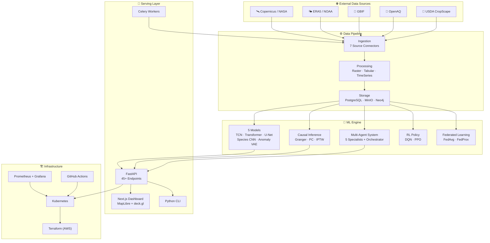

<div align="center">

# 🌍 EcoTrack

### Planetary Environmental Intelligence Platform

[](https://github.com/ecotrack/ecotrack/actions/workflows/ci.yml)
[](LICENSE)
[](https://www.python.org/downloads/)
[](https://www.typescriptlang.org/)
[](CONTRIBUTING.md)
[](https://github.com/astral-sh/ruff)

**An open-source, production-grade AI system for monitoring, modeling, predicting, and helping heal planet Earth.**

[Technical Vision](docs/vision/TECHNICAL_VISION.md) · [Architecture](docs/architecture/SYSTEM_ARCHITECTURE.md) · [API Docs](API.md) · [Dashboard](http://localhost:3000) · [Contributing](CONTRIBUTING.md)

</div>

---

> **⚠️ Important Notice**  
> EcoTrack is currently a **comprehensive proposal and architectural blueprint** — a vision brought to life as code. This system is **untested and under active development**. We are working towards building this into a fully functional platform.  
>  
> **This project is open to contribution, collaboration, and building together.**  
> If you share our mission for Earth, join us. Every line of code, every idea, every act of care matters.  
>  
> 🌱 *In the making for a decade. Built with love.*

---

## 🌍 Our Mission

**For Earth. For all life. For longevity.**

EcoTrack exists because our planet — and every living being on it — deserves a healthier, more sustainable future. We believe that by uniting artificial intelligence with environmental science, we can build the tools humanity needs to understand, protect, and heal the Earth.

This is not just software. This is a love letter to the planet — an open invitation to every researcher, developer, and dreamer who believes technology should serve life itself.

*Why hate, when we can love? Why destroy, when we can build? Why discard, when we can fix?*

We are the solution. Let us be the healers and guardians of planet Earth — mother to all.

> *"Look again at that dot. That's here. That's home. That's us. On it everyone you love, everyone you know, everyone you ever heard of, every human being who ever was, lived out their lives... on a mote of dust suspended in a sunbeam."*  
> — **Carl Sagan**, *Pale Blue Dot*

Our planet is fragile. Our planet is precious. And it is the only home we have ever known. Let us fill it with love. Let us create heaven on Earth.

*From the whitehole of love — where creation begins.* 🤍

---

## 💚 Our Philosophy

**Plant a tree today, so future generations may rest in its shade.**

EcoTrack is and will always be:

- **🆓 Free forever** — No subscriptions. No paywalls. No monetization of Earth's data. Ever.
- **💝 Donation-supported** — We sustain ourselves through the generosity of those who care. Open to donors, investors, and visionaries who want to help leave behind a better planet.
- **🌐 Open source** — Every line of code is yours. Fork it. Build on it. Make it better. This belongs to humanity.
- **🤝 Community-driven** — Built by people who love Earth, for people who love Earth. No gatekeeping.
- **🔬 Science-first** — Grounded in rigorous research, open data, and reproducible methods.

We don't build for profit. We build for the planet. The long-term sustainability of Earth and all its life forms — including us, Homo sapiens — is the only metric that matters.

---

## 🎯 Aligned with the UN Sustainable Development Goals

EcoTrack is designed to directly support the [United Nations 17 Sustainable Development Goals](https://sdgs.un.org/goals):

| SDG | Goal | EcoTrack Contribution |
|-----|------|----------------------|
| 1️⃣ SDG 1 | No Poverty | Resource equity analytics, environmental justice scoring |
| 2️⃣ SDG 2 | Zero Hunger | Crop yield prediction, drought early warning, food security index |
| 3️⃣ SDG 3 | Good Health | Air quality monitoring, disease vector prediction, heat vulnerability |
| 💧 SDG 6 | Clean Water & Sanitation | Water stress monitoring, quality tracking, equitable allocation |
| ⚡ SDG 7 | Affordable & Clean Energy | Renewable distribution, carbon trading optimization |
| 🏗️ SDG 9 | Industry & Innovation | AI infrastructure for environmental intelligence |
| ⚖️ SDG 10 | Reduced Inequalities | Environmental justice, equitable resource distribution |
| 🏙️ SDG 11 | Sustainable Cities | Urban heat mapping, air quality, environmental justice |
| ♻️ SDG 12 | Responsible Consumption | Resource optimization, sustainability modeling |
| 🌡️ SDG 13 | Climate Action | Climate forecasting, anomaly detection, emission tracking |
| 🌊 SDG 14 | Life Below Water | Ocean monitoring, marine ecosystem health |
| 🌳 SDG 15 | Life on Land | Biodiversity monitoring, deforestation tracking, habitat assessment |
| 🕊️ SDG 16 | Peace & Justice | Transparent data, open governance tools |
| 🤝 SDG 17 | Partnerships | Open-source collaboration, federated learning, shared knowledge |

---

## 🚀 Moonshot Goals

We dream big because the planet deserves nothing less. These are our audacious goals:

### 🌍 Near-term (2026-2027)
- [ ] Real-time environmental monitoring dashboard covering every continent
- [ ] 50+ open data source integrations spanning all five domains
- [ ] Operational climate forecasting with uncertainty quantification
- [ ] Biodiversity early warning system for 1,000+ endangered species
- [ ] First federated learning deployment across distributed sensor networks

### 🌏 Mid-term (2027-2029)
- [ ] Planetary digital twin — a living, breathing model of Earth's systems
- [ ] AI-powered policy recommendation engine used by 10+ governments
- [ ] Carbon credit verification system reducing fraud by 90%
- [ ] Predict and prevent 50% of crop failures in vulnerable regions
- [ ] Environmental justice scoring adopted in urban planning worldwide
- [ ] 100,000+ active contributors in the EcoTrack community

### 🌎 Long-term (2029-2035)
- [ ] Autonomous Earth monitoring — self-healing sensor networks across land, sea, and air
- [ ] Every child on Earth has access to clean air and water data for their neighborhood
- [ ] AI-guided reforestation restoring 1 billion hectares of degraded land
- [ ] Measurable reversal of biodiversity loss in monitored regions
- [ ] EcoTrack becomes the global standard for environmental intelligence
- [ ] **Net positive impact on planetary health — we gave back more than we took**

### 🌌 The Ultimate Dream
- [ ] A thriving, sustainable Earth where technology and nature exist in harmony
- [ ] Every ecosystem monitored, every species protected, every community empowered
- [ ] Heaven on Earth — not as fantasy, but as engineering reality

*"The Earth is the only world known so far to harbor life. There is nowhere else, at least in the near future, to which our species could migrate. Visit, yes. Settle, not yet. Like it or not, for the moment the Earth is where we make our stand."*  
— **Carl Sagan**

---

## Overview

**EcoTrack** is a comprehensive AI-for-Earth platform that integrates satellite imagery, climate data, biodiversity records, air quality measurements, and agricultural information into a unified intelligence system. It combines modern machine learning — including causal inference, multi-agent coordination, reinforcement learning, and federated learning — with a production-grade data pipeline to deliver actionable environmental insights at planetary scale.

The platform is designed for researchers, policymakers, conservation organizations, and developers who need a robust, extensible foundation for environmental monitoring and decision support. EcoTrack ingests data from 7 real-world sources, processes it through 5 specialized ML models, reasons over a knowledge graph, and serves results through a 45+ endpoint REST API and an interactive geospatial dashboard.

---

## Key Features

### 🌡️ Climate Intelligence
Ingest ERA5 reanalysis and NOAA station data, detect anomalies with a Variational Autoencoder, and forecast climate variables using Temporal Convolutional Networks and Transformer architectures. Explore CMIP6 SSP scenarios with interactive downscaling.

### 🦎 Biodiversity Sentinel
Monitor species distributions with GBIF occurrence data, classify species with deep learning, detect deforestation from Copernicus Sentinel imagery, and model habitat quality through a Neo4j knowledge graph enriched with ENVO/SWEET ontologies.

### 🏥 Health Shield
Track air quality from the OpenAQ network, forecast pollutant concentrations, map disease vector risk zones, and compute environmental health exposure indices across communities.

### 🌾 Food Security Monitor
Predict crop yields with satellite-derived vegetation indices and weather data, monitor drought conditions with SPI/SPEI, and provide early warnings for food-insecure regions using USDA CropScape land cover data.

### ⚖️ Resource Equity Engine
Compute environmental justice scores that combine pollution burden, socioeconomic vulnerability, and health access. Optimize resource allocation with reinforcement learning (water, carbon credits, conservation budgets) while balancing equity constraints.

---

## Architecture Overview



---

## Quick Start

Get EcoTrack running locally in under 5 minutes with Docker Compose.

### Prerequisites

- [Docker](https://docs.docker.com/get-docker/) 24+ and [Docker Compose](https://docs.docker.com/compose/) v2
- 8 GB RAM minimum (16 GB recommended)
- 10 GB free disk space

### 1. Clone the Repository

```bash
git clone https://github.com/ecotrack/ecotrack.git
cd ecotrack
```

### 2. Configure Environment

```bash
cp configs/development/.env.example .env
```

### 3. Start All Services

```bash
docker compose up -d
```

This launches PostgreSQL (with PostGIS + TimescaleDB), Redis, Neo4j, MinIO, MLflow, the FastAPI Python API, the Next.js dashboard, and the Celery worker.

### 4. Verify Services

```bash
# Check all containers are healthy
docker compose ps

# Test the API
curl http://localhost:8000/api/v1/health

# Open the dashboard
open http://localhost:3000
```

### 5. Make Your First API Call

```bash
# Get climate observations for a location
curl "http://localhost:8000/api/v1/climate/observations?h3_index=872830828ffffff&variable=temperature"

# Ask the agent system a question
curl -X POST http://localhost:8000/api/v1/agents/query \
  -H "Content-Type: application/json" \
  -d '{"question": "What are the current temperature trends in the Amazon basin?"}'
```

> 📖 For a detailed walkthrough, see the [Quickstart Tutorial](docs/tutorials/QUICKSTART.md).

---

## Project Structure

```
EcoTrack/
├── apps/                               # Deployable applications
│   ├── api/                            # NestJS API Gateway (TypeScript)
│   ├── api-python/                     # FastAPI Python API (45+ endpoints)
│   ├── web/                            # Next.js 15 Dashboard
│   ├── worker/                         # Celery async workers
│   └── cli/                            # Python CLI (Click)
├── packages/                           # Shared Python libraries
│   ├── data-pipeline/                  # ETL with 7 source connectors
│   ├── ml/                             # 5 ML model architectures
│   ├── geo/                            # Geospatial utilities (CRS, raster, vector)
│   ├── knowledge-graph/                # Neo4j KG with ontology reasoning
│   ├── agents/                         # Multi-agent system (5 specialists)
│   ├── causal/                         # Causal discovery & inference
│   ├── rl-policy/                      # RL environments & agents (DQN/PPO)
│   └── federated/                      # Federated learning with DP
├── infrastructure/
│   ├── terraform/                      # AWS infrastructure (EKS, RDS, S3)
│   ├── kubernetes/                     # Kustomize base + staging/production
│   ├── docker/                         # Dockerfiles & monitoring compose
│   └── monitoring/                     # Prometheus rules, Grafana dashboards
├── tests/                              # Unit, integration, E2E, load tests
│   ├── unit/                           # 60+ unit tests across all packages
│   ├── integration/                    # Pipeline integration tests
│   ├── e2e/                            # End-to-end tests
│   └── load/                           # Load testing
├── configs/                            # Environment-specific configuration
├── docs/                               # Architecture, vision, tutorials
├── research/                           # Notebooks & experiments
├── scripts/                            # Dev setup, migrations, seeding
├── supabase/                           # Database migration SQL files
├── docker-compose.yml                  # Local development stack
├── pyproject.toml                      # Python workspace configuration
├── Makefile                            # Development task runner
└── README.md                           # This file
```

---

## Packages

| Package | Import | Description |
|---------|--------|-------------|
| [**data-pipeline**](packages/data-pipeline/) | `ecotrack_data` | ETL framework with 7 source connectors, 3 processor types, and multi-backend storage |
| [**ml**](packages/ml/) | `ecotrack_ml` | 5 model architectures, training pipeline, evaluation framework, ONNX inference, MLflow registry |
| [**geo**](packages/geo/) | `ecotrack_geo` | CRS transformations, raster processing, H3 tiling, vector operations |
| [**knowledge-graph**](packages/knowledge-graph/) | `ecotrack_kg` | Neo4j client, ENVO/SWEET ontology builder, Cypher queries, graph reasoning |
| [**agents**](packages/agents/) | `ecotrack_agents` | 5 specialist agents + orchestrator, 16+ tools, shared memory |
| [**causal**](packages/causal/) | `ecotrack_causal` | Granger/PC discovery, IPTW/matching/regression estimation, counterfactual analysis |
| [**rl-policy**](packages/rl-policy/) | `ecotrack_rl` | 3 Gymnasium environments (water, carbon, conservation), DQN/PPO agents, reward shaping |
| [**federated**](packages/federated/) | `ecotrack_federated` | FedAvg/FedProx/FedMedian/FedTrimmedMean strategies, differential privacy, secure aggregation |

---

## API Reference

The FastAPI Python API exposes 45+ endpoints organized by environmental domain. Full documentation is available in [API.md](API.md) and at `http://localhost:8000/docs` (Swagger UI) when running locally.

### Endpoint Summary

| Domain | Base Path | Endpoints | Description |
|--------|-----------|-----------|-------------|
| **Climate** | `/api/v1/climate` | 7 | Observations, forecasts, anomalies, scenarios |
| **Biodiversity** | `/api/v1/biodiversity` | 5 | Species, occurrences, habitat, deforestation |
| **Health** | `/api/v1/health` | 3 | Air quality, forecasts, vector risk |
| **Food** | `/api/v1/food` | 3 | Crop monitoring, yield forecast, drought |
| **Equity** | `/api/v1/equity` | 2 | Justice scores, breakdowns |
| **Agents** | `/api/v1/agents` | 1 | Natural language query interface |
| **Catalog** | `/api/v1/catalog` | 2 | STAC collections and search |
| **Alerts** | `/api/v1/alerts` | 1 | Active environmental alerts |
| **ML** | `/ml/v1` | 6 | Model inference, registry, model cards |
| **System** | `/api/v1` | 3 | Health check, metrics, version |
| **WebSocket** | `/ws/alerts` | — | Real-time alert streaming |

### Example: Climate Forecast

```bash
curl "http://localhost:8000/api/v1/climate/forecasts?h3_index=872830828ffffff&variable=temperature&lead_hours=72"
```

```json
{
  "model_name": "climate-forecast-tcn",
  "model_version": "1.0.0",
  "h3_index": "872830828ffffff",
  "forecasts": [
    {
      "forecast_time": "2026-02-19T00:00:00Z",
      "lead_hours": 24,
      "value_mean": 15.2,
      "value_p10": 13.8,
      "value_p90": 16.7
    }
  ]
}
```

### Example: Agent Query

```bash
curl -X POST http://localhost:8000/api/v1/agents/query \
  -H "Content-Type: application/json" \
  -d '{"question": "How has deforestation in Borneo affected local biodiversity over the past decade?"}'
```

```json
{
  "answer": "Deforestation in Borneo has accelerated significantly...",
  "confidence": 0.87,
  "sources": [
    {"type": "dataset", "name": "GBIF Occurrences"},
    {"type": "knowledge_graph", "name": "Species-Habitat Relations"}
  ],
  "visualizations": [
    {"type": "map", "data": {"type": "FeatureCollection", "features": []}}
  ]
}
```

---

## Data Sources

EcoTrack integrates 7 real-world environmental data sources:

| Source | Module | Data Types | Coverage | Update Frequency |
|--------|--------|-----------|----------|-----------------|
| [**Copernicus**](https://scihub.copernicus.eu/) | [`copernicus.py`](packages/data-pipeline/ecotrack_data/sources/copernicus.py) | Sentinel satellite imagery | Global | 5-day revisit |
| [**NASA Earthdata**](https://earthdata.nasa.gov/) | [`nasa_earthdata.py`](packages/data-pipeline/ecotrack_data/sources/nasa_earthdata.py) | MODIS, Landsat, VIIRS | Global | Daily |
| [**NOAA Climate**](https://www.ncei.noaa.gov/) | [`noaa_climate.py`](packages/data-pipeline/ecotrack_data/sources/noaa_climate.py) | Station observations, GFS | Global | Hourly |
| [**OpenAQ**](https://openaq.org/) | [`openaq.py`](packages/data-pipeline/ecotrack_data/sources/openaq.py) | Air quality measurements | 100+ countries | Real-time |
| [**GBIF**](https://www.gbif.org/) | [`gbif.py`](packages/data-pipeline/ecotrack_data/sources/gbif.py) | Species occurrences | Global | Continuous |
| [**ERA5**](https://cds.climate.copernicus.eu/) | [`era5.py`](packages/data-pipeline/ecotrack_data/sources/era5.py) | Climate reanalysis (1940–present) | Global 0.25° | Monthly |
| [**USDA CropScape**](https://nassgeodata.gmu.edu/CropScape/) | [`usda_cropscape.py`](packages/data-pipeline/ecotrack_data/sources/usda_cropscape.py) | Cropland data layers | United States | Annual |

---

## ML Models

| Model | Module | Task | Architecture | Input | Output |
|-------|--------|------|-------------|-------|--------|
| **Climate Forecaster** | [`climate_forecaster.py`](packages/ml/ecotrack_ml/models/climate_forecaster.py) | Time-series forecasting | TCN + Transformer | Multi-variate climate series | Temperature, precipitation, wind forecasts |
| **Land Cover Segmenter** | [`land_cover.py`](packages/ml/ecotrack_ml/models/land_cover.py) | Semantic segmentation | U-Net with ResNet encoder | Sentinel-2 multispectral | Land cover classification maps |
| **Species Detector** | [`species_detector.py`](packages/ml/ecotrack_ml/models/species_detector.py) | Image classification | CNN (ResNet/EfficientNet) | Camera trap / field images | Species identification + confidence |
| **Anomaly Detector** | [`anomaly_detector.py`](packages/ml/ecotrack_ml/models/anomaly_detector.py) | Anomaly detection | Variational Autoencoder | Multi-variate environmental series | Anomaly scores + severity |
| **Crop Yield Predictor** | [`crop_yield.py`](packages/ml/ecotrack_ml/models/crop_yield.py) | Regression | Gradient-boosted ensemble | NDVI, soil moisture, weather | Yield estimates (tonnes/ha) |

---

## Technology Stack

### Languages & Frameworks

| Layer | Technology |
|-------|-----------|
| **ML / Data** | Python 3.11+, PyTorch 2.x, scikit-learn, xarray, rasterio, geopandas |
| **API** | FastAPI, Pydantic, Uvicorn, Celery |
| **Frontend** | Next.js 15, TypeScript 5, React 19, MapLibre GL, deck.gl, Zustand |
| **CLI** | Click, Rich |

### Data & Storage

| Component | Technology |
|-----------|-----------|
| **Relational + Geospatial** | PostgreSQL 16 + PostGIS + TimescaleDB + pgvector |
| **Knowledge Graph** | Neo4j 5 Community + APOC |
| **Cache & Broker** | Redis 7 |
| **Object Storage** | MinIO (S3-compatible) |
| **ML Tracking** | MLflow 2.11 |

### Infrastructure & Operations

| Component | Technology |
|-----------|-----------|
| **Containers** | Docker, Docker Compose |
| **Orchestration** | Kubernetes (Kustomize overlays) |
| **IaC** | Terraform (AWS: EKS, RDS, S3, ElastiCache, ECR) |
| **CI/CD** | GitHub Actions |
| **Monitoring** | Prometheus, Grafana, Loki, Jaeger |
| **Security** | JWT/API key auth, rate limiting, CSP headers, Trivy scanning |

---

## Development

### Prerequisites

- Python 3.11+
- Node.js 20+
- Docker & Docker Compose

### Local Setup

```bash
# 1. Clone and enter the project
git clone https://github.com/ecotrack/ecotrack.git
cd ecotrack

# 2. Start infrastructure services
docker compose up -d postgres redis neo4j minio mlflow

# 3. Install all Python packages in editable mode
make install

# 4. Run database migrations
make migrate

# 5. Start the API in development mode
uvicorn ecotrack_api.main:app --host 0.0.0.0 --port 8000 --reload

# 6. (Optional) Start the Next.js dashboard
cd apps/web && npm install && npm run dev
```

### Code Quality

```bash
# Lint with ruff
make lint

# Format code
make format

# Type-check with mypy
mypy packages/ apps/api-python/ apps/worker/ apps/cli/
```

> See [SETUP.md](SETUP.md) for detailed setup instructions including environment variables and troubleshooting.

---

## Testing

EcoTrack has 60+ tests covering all packages:

```bash
# Run all tests
make test

# Run with verbose output
pytest -v --tb=short

# Run tests for a specific package
pytest tests/unit/test_ml/ -v

# Run integration tests (requires running services)
pytest tests/integration/ -v

# Generate coverage report
pytest --cov=packages --cov-report=html
```

### Test Structure

| Directory | Scope | Count |
|-----------|-------|-------|
| `tests/unit/test_ml/` | ML models, training, inference | 12 |
| `tests/unit/test_data_pipeline/` | Sources, processors, storage | 10 |
| `tests/unit/test_agents/` | Orchestrator, specialists, tools | 8 |
| `tests/unit/test_causal/` | Discovery, estimation, counterfactuals | 6 |
| `tests/unit/test_rl/` | Environments, agents, policies | 8 |
| `tests/unit/test_federated/` | Strategies, privacy, aggregation | 6 |
| `tests/unit/test_kg/` | Builder, queries, reasoning | 5 |
| `tests/unit/test_geo/` | CRS, raster, tiling, vector | 5 |
| `tests/unit/test_api/` | Endpoint routing, validation | 4 |
| `tests/integration/` | Pipeline end-to-end flows | 3 |

---

## Deployment

### Docker Compose (Staging)

```bash
docker compose -f docker-compose.yml up -d
```

### Kubernetes (Production)

```bash
# Apply base resources
kubectl apply -k infrastructure/kubernetes/base/

# Apply production overlay
kubectl apply -k infrastructure/kubernetes/overlays/production/
```

### Terraform (AWS Infrastructure)

```bash
cd infrastructure/terraform
terraform init
terraform plan -var-file=production.tfvars
terraform apply -var-file=production.tfvars
```

> See [SETUP.md](SETUP.md) for full deployment guide including monitoring stack setup.

---

## Roadmap

### v1.0 — Foundation (Current)
- [x] Core domain models for 5 environmental domains
- [x] Data pipeline with 7 source connectors
- [x] ML engine with 5 model architectures
- [x] Knowledge graph with ENVO/SWEET ontology
- [x] Causal inference engine (discovery + estimation)
- [x] Multi-agent coordination system
- [x] RL policy optimization (3 environments)
- [x] Federated learning with differential privacy
- [x] FastAPI REST API (45+ endpoints)
- [x] Next.js geospatial dashboard
- [x] Kubernetes & Terraform infrastructure
- [x] Prometheus/Grafana monitoring
- [x] 60+ unit tests

### v2.0 — Scale & Intelligence
- [ ] Apache Kafka event streaming
- [ ] Apache Airflow DAG orchestration
- [ ] GraphQL API layer
- [ ] Digital twin environments
- [ ] ONNX model optimization & Triton serving
- [ ] Real-time Sentinel-2 processing pipeline
- [ ] Multi-language SDK (Python, JavaScript, R)
- [ ] Expanded test suite (200+ tests, 85%+ coverage)

### v3.0 — Global Impact
- [ ] Apache Spark + Sedona for petabyte-scale processing
- [ ] WASM-based edge inference
- [ ] Mobile-native applications
- [ ] Multi-tenant SaaS deployment
- [ ] UN SDG indicator tracking
- [ ] Public API for researchers & NGOs
- [ ] Community plugin marketplace

---

## Contributing

We welcome contributions of all kinds — code, documentation, bug reports, feature requests, and research ideas. See [CONTRIBUTING.md](CONTRIBUTING.md) for the full guide.

**Quick contribution steps:**

1. Fork the repository
2. Create a feature branch (`git checkout -b feature/amazing-improvement`)
3. Make your changes following the [code style guide](CONTRIBUTING.md#code-style)
4. Write tests for new functionality
5. Commit with [Conventional Commits](https://www.conventionalcommits.org/) (`git commit -m 'feat: add amazing improvement'`)
6. Push and open a Pull Request

---

## 📜 License

EcoTrack is released under the [Apache License 2.0](LICENSE) — **free for everyone to use, modify, distribute, and build upon**.

**EcoTrack is and will always be free.** Nothing we do will ever be based on taking money, subscriptions, or fees. The project sustains itself through **voluntary donations only** and is open to **investors and visionaries** who want to help leave behind a better planet for future generations.

We believe that the tools to understand and heal our planet should be openly available to every researcher, developer, organization, and community worldwide. No restrictions. No gatekeeping. Just open science for Earth.

> *"We are the solution. Let us be the healers and guardians of Planet Earth — let's create heaven on Earth, together."*

---

## Acknowledgments

### Open Data Providers

- [Copernicus Programme](https://www.copernicus.eu/) — European Space Agency satellite data
- [NASA Earthdata](https://earthdata.nasa.gov/) — MODIS, Landsat, VIIRS
- [NOAA NCEI](https://www.ncei.noaa.gov/) — Global climate station network
- [OpenAQ](https://openaq.org/) — Open air quality data
- [GBIF](https://www.gbif.org/) — Global Biodiversity Information Facility
- [Copernicus Climate Data Store](https://cds.climate.copernicus.eu/) — ERA5 reanalysis
- [USDA NASS](https://www.nass.usda.gov/) — CropScape land cover data

### Frameworks & Libraries

- [PyTorch](https://pytorch.org/) — Deep learning framework
- [FastAPI](https://fastapi.tiangolo.com/) — Modern Python web framework
- [Next.js](https://nextjs.org/) — React framework
- [Neo4j](https://neo4j.com/) — Graph database
- [MLflow](https://mlflow.org/) — ML experiment tracking
- [TimescaleDB](https://www.timescale.com/) — Time-series database
- [MapLibre](https://maplibre.org/) — Open-source maps
- [deck.gl](https://deck.gl/) — Large-scale geospatial visualization

### Research References

- Rolnick et al., "Tackling Climate Change with Machine Learning" (2019)
- Jetz et al., "Essential Biodiversity Variables" (2012)
- Runge et al., "Inferring Causation from Time Series" (2019)
- McMahan et al., "Communication-Efficient Learning of Deep Networks from Decentralized Data" (2017)
- Li et al., "Federated Optimization in Heterogeneous Networks" (FedProx, 2020)

---

<div align="center">

**Built with ❤️ for Planet Earth — for the long-term sustainability of all life forms, including us.**

*In the making for a decade, built with love.* 🌱

[⬆ Back to Top](#-ecotrack)

</div>
