# EcoTrack: System Architecture Document

**Version:** 1.0.0-draft | **Status:** Living Document
**License:** Apache 2.0 | **Companion:** [`TECHNICAL_VISION.md`](../vision/TECHNICAL_VISION.md)

---

## Table of Contents

- [1. High-Level System Overview](#1-high-level-system-overview)
- [2. Repository Structure](#2-repository-structure)
- [3. Data Architecture](#3-data-architecture)
- [4. ML/AI Architecture](#4-mlai-architecture)
- [5. API Architecture](#5-api-architecture)
- [6. Event-Driven Architecture](#6-event-driven-architecture)
- [7. Multi-Agent System Architecture](#7-multi-agent-system-architecture)
- [8. Security Architecture](#8-security-architecture)
- [9. Observability Architecture](#9-observability-architecture)
- [10. Deployment Architecture](#10-deployment-architecture)
- [11. Interface Contracts](#11-interface-contracts)
- [12. Configuration Management](#12-configuration-management)
- [Appendix A: Technology Version Matrix](#appendix-a-technology-version-matrix)
- [Appendix B: Glossary](#appendix-b-glossary)

---

# 1. High-Level System Overview

## 1.1 Architectural Philosophy

| Pattern                 | Where Applied                           | Rationale                             |
| ----------------------- | --------------------------------------- | ------------------------------------- |
| **Event-Driven**  | Data ingestion, alerts, model lifecycle | Loose coupling; replay capability     |
| **Microservices** | Domain services, ML serving, pipeline   | Independent scaling; polyglot         |
| **CQRS**          | Climate queries vs data ingestion       | Read-optimized separately from writes |
| **Hexagonal**     | Core domain logic                       | Testability; storage independence     |
| **Strangler Fig** | Migration from current codebase         | Incremental evolution                 |

## 1.2 v1.0 Scope

**In Scope:** API Gateway, ML Serving, Web Dashboard, Async Workers, CLI, PostgreSQL+PostGIS+TimescaleDB, Redis, MinIO, Neo4j, Kafka, Airflow, MLflow, Climate Intelligence, scaffolded domain services.

**Deferred to v2.0+:** Federated Learning, Digital Twin, RL Policy, WASM, Flink, Spark+Sedona, Triton.

## 1.3 System Architecture Diagram

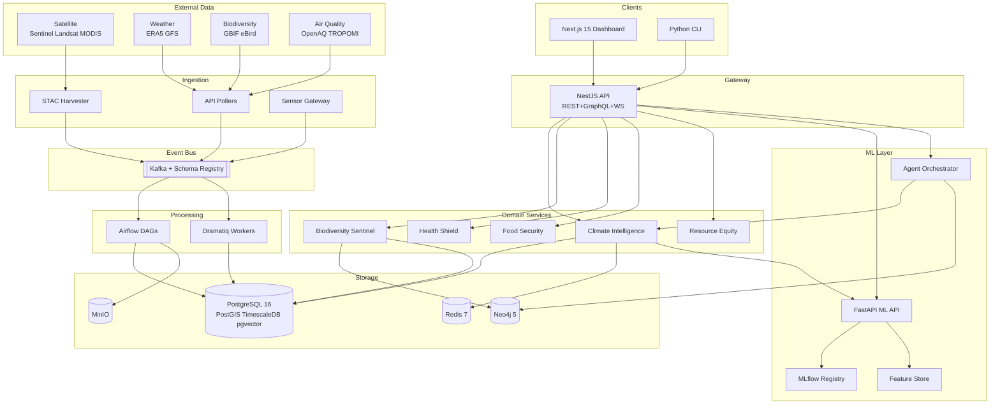

## 1.4 Key Architectural Decisions

### ADR-001: Polyglot Monorepo

**Decision:** Single monorepo with TypeScript for API/frontend and Python for ML/data.

- ✅ Shared types via OpenAPI code generation
- ✅ Single CI/CD pipeline; atomic cross-service changes
- ❌ Build tooling complexity across two ecosystems
- **Rejected:** Polyrepo (coordination overhead), All-Python (poor frontend), All-TypeScript (ML gaps)

### ADR-002: NestJS Gateway + FastAPI ML API

**Decision:** NestJS for client-facing traffic; FastAPI for ML inference.

- NestJS: enterprise patterns — modules, guards, interceptors — ideal for API gateways
- FastAPI: async Python with native PyTorch/xarray access for ML serving
- Clear boundary: NestJS = business logic; FastAPI = ML compute

### ADR-003: PostgreSQL as Unified Data Platform

**Decision:** PostgreSQL 16 with PostGIS + TimescaleDB + pgvector extensions.

- ✅ Single backup/HA/monitoring; cross-domain JOINs; familiar SQL
- ❌ pgvector less performant than dedicated vector DBs at 100M+ vectors
- ❌ Single point of failure without proper HA
- **Rejected:** Separate MongoDB/InfluxDB/Pinecone — too much operational overhead

### ADR-004: Apache Kafka as Event Bus

**Decision:** Kafka with Schema Registry for all async communication.

- ✅ Durable log with replay; H3 topic partitioning; exactly-once semantics
- ❌ Operational complexity; overkill at laptop scale (mitigated by compose profiles)
- **Rejected:** Redis Streams (no replay), RabbitMQ (not event-log), NATS (small ecosystem)

### ADR-005: Neo4j for Knowledge Graph

**Decision:** Neo4j Community Edition for environmental KG.

- ✅ Cypher query language; GDS library; APOC utilities
- ❌ Community Edition lacks clustering; no native RDF
- **Rejected:** Apache Jena (lower performance), Amazon Neptune (proprietary)

---

# 2. Repository Structure

## 2.1 Monorepo Layout

```
EcoTrack/
├── apps/                           # Deployable applications
│   ├── api/                        # NestJS API Gateway [TypeScript]
│   │   └── src/
│   │       ├── main.ts, app.module.ts
│   │       ├── common/             # Guards, pipes, interceptors
│   │       ├── auth/               # JWT + API key auth
│   │       ├── climate/            # Climate domain routes
│   │       ├── biodiversity/       # Biodiversity routes
│   │       ├── health/             # Health routes
│   │       ├── food/               # Food security routes
│   │       ├── equity/             # Resource equity routes
│   │       ├── agents/             # Agent query endpoint
│   │       ├── data-catalog/       # STAC catalog API
│   │       ├── graphql/            # GraphQL resolvers
│   │       └── websocket/          # Real-time event gateway
│   ├── web/                        # Next.js 15 Dashboard [TypeScript]
│   │   └── src/
│   │       ├── app/                # App Router (dashboard, explore, scenarios, agents)
│   │       ├── components/         # map/ (MapLibre+deck.gl), charts/, shared/
│   │       ├── hooks/, lib/, store/ (Zustand), types/
│   ├── ml-api/                     # FastAPI ML Serving [Python]
│   │   └── src/ (main.py, routers/, services/, schemas/)
│   ├── worker/                     # Async Workers [Python/Dramatiq]
│   │   └── src/ (tasks/, consumers/)
│   └── cli/                        # CLI Tools [Python/Click]
│       └── src/commands/
├── packages/                       # Shared libraries
│   ├── core/                       # Domain models + schemas [Python]
│   ├── ml/                         # ML training + inference [Python]
│   ├── data-pipeline/              # ETL + ingestion [Python]
│   ├── knowledge-graph/            # KG construction [Python]
│   ├── agents/                     # Multi-agent system [Python]
│   ├── causal/                     # Causal inference [Python]
│   ├── federated/                  # Federated learning [v2.0]
│   ├── rl-policy/                  # RL optimization [v2.0]
│   ├── geo/                        # Geospatial utils [Python+Rust]
│   └── ui/                         # Shared UI components [TypeScript]
├── infrastructure/
│   ├── terraform/                  # IaC modules + environments
│   ├── kubernetes/                 # Kustomize base + overlays + Helm
│   └── docker/                     # Compose variants (full, min, ml, test)
├── tests/                          # Integration, E2E (Playwright), load (k6)
├── docs/                           # Architecture, vision, guides, ADRs, RFCs
├── scripts/                        # setup.sh, dev.sh, seed-data.sh, migrate.sh
├── configs/                        # Environment configs, Kafka schemas, Grafana dashboards
├── research/                       # Notebooks + experiments
├── docker-compose.yml
├── package.json, turbo.json, pyproject.toml
└── README.md
```

## 2.2 Package Dependency Graph

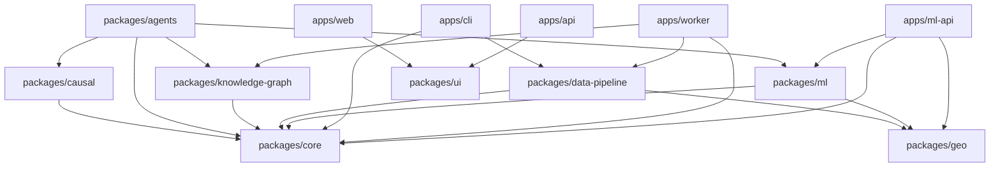

## 2.3 Naming Conventions

| Item                | Convention                    | Example                               |
| ------------------- | ----------------------------- | ------------------------------------- |
| Python packages     | `ecotrack_{name}`           | `ecotrack_core`                     |
| TypeScript packages | `@ecotrack/{name}`          | `@ecotrack/ui`                      |
| Docker images       | `ecotrack/{service}`        | `ecotrack/api`                      |
| Kafka topics        | `ecotrack.{domain}.{event}` | `ecotrack.climate.anomaly-detected` |
| DB schemas          | `eco_{domain}`              | `eco_climate`                       |

---

# 3. Data Architecture

## 3.1 Data Flow Diagram

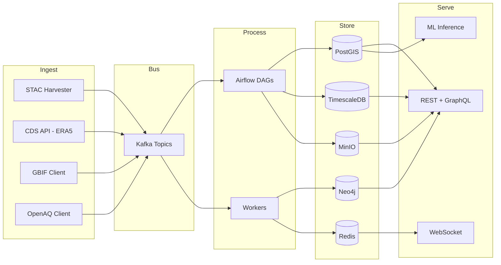

## 3.2 Database Schema Design

### 3.2.1 Core Schema — PostgreSQL + PostGIS

```sql
CREATE SCHEMA eco_core;

CREATE TABLE eco_core.regions (
    id              UUID PRIMARY KEY DEFAULT gen_random_uuid(),
    name            VARCHAR(255) NOT NULL,
    h3_index        VARCHAR(15) NOT NULL,
    h3_resolution   SMALLINT NOT NULL,
    geometry        GEOMETRY(MultiPolygon, 4326) NOT NULL,
    area_km2        DOUBLE PRECISION,
    country_iso3    CHAR(3),
    admin_level     SMALLINT,
    properties      JSONB DEFAULT '{}'
);
CREATE INDEX idx_regions_h3 ON eco_core.regions (h3_index);
CREATE INDEX idx_regions_geom ON eco_core.regions USING GIST (geometry);

CREATE TABLE eco_core.data_sources (
    id              UUID PRIMARY KEY DEFAULT gen_random_uuid(),
    name            VARCHAR(255) NOT NULL UNIQUE,
    source_type     VARCHAR(50) NOT NULL,
    provider        VARCHAR(255),
    license         VARCHAR(100),
    stac_collection_id VARCHAR(255),
    config          JSONB DEFAULT '{}',
    is_active       BOOLEAN DEFAULT TRUE,
    last_sync_at    TIMESTAMPTZ
);

CREATE TABLE eco_core.catalog_items (
    id              UUID PRIMARY KEY DEFAULT gen_random_uuid(),
    stac_id         VARCHAR(255) NOT NULL,
    collection_id   VARCHAR(255) NOT NULL,
    source_id       UUID REFERENCES eco_core.data_sources(id),
    geometry        GEOMETRY(Geometry, 4326) NOT NULL,
    bbox            DOUBLE PRECISION[4],
    datetime_start  TIMESTAMPTZ NOT NULL,
    datetime_end    TIMESTAMPTZ,
    h3_cells        VARCHAR(15)[],
    properties      JSONB NOT NULL DEFAULT '{}',
    assets          JSONB NOT NULL DEFAULT '{}'
);
CREATE INDEX idx_catalog_geom ON eco_core.catalog_items USING GIST (geometry);
CREATE INDEX idx_catalog_h3 ON eco_core.catalog_items USING GIN (h3_cells);

CREATE TABLE eco_core.users (
    id              UUID PRIMARY KEY,
    email           VARCHAR(255) NOT NULL UNIQUE,
    role            VARCHAR(50) DEFAULT 'viewer',
    api_key_hash    VARCHAR(255),
    quota_tier      VARCHAR(50) DEFAULT 'free',
    preferences     JSONB DEFAULT '{}'
);

CREATE TABLE eco_core.alerts (
    id              UUID PRIMARY KEY DEFAULT gen_random_uuid(),
    alert_type      VARCHAR(100) NOT NULL,
    domain          VARCHAR(50) NOT NULL,
    severity        VARCHAR(20) NOT NULL,
    title           VARCHAR(500) NOT NULL,
    description     TEXT,
    geometry        GEOMETRY(Geometry, 4326),
    h3_index        VARCHAR(15),
    valid_from      TIMESTAMPTZ NOT NULL,
    valid_until     TIMESTAMPTZ,
    metadata        JSONB DEFAULT '{}'
);
```

### 3.2.2 Climate Schema — TimescaleDB Hypertables

```sql
CREATE SCHEMA eco_climate;

CREATE TABLE eco_climate.observations (
    id          BIGSERIAL,
    h3_index    VARCHAR(15) NOT NULL,
    observed_at TIMESTAMPTZ NOT NULL,
    variable    VARCHAR(50) NOT NULL,
    value       DOUBLE PRECISION NOT NULL,
    unit        VARCHAR(20) NOT NULL,
    quality_flag SMALLINT DEFAULT 0,
    PRIMARY KEY (id, observed_at)
);
SELECT create_hypertable('eco_climate.observations', 'observed_at',
    chunk_time_interval => INTERVAL '1 day');

CREATE TABLE eco_climate.forecasts (
    id          BIGSERIAL,
    model_name  VARCHAR(100) NOT NULL,
    run_id      UUID NOT NULL,
    h3_index    VARCHAR(15) NOT NULL,
    forecast_time TIMESTAMPTZ NOT NULL,
    lead_hours  INTEGER NOT NULL,
    variable    VARCHAR(50) NOT NULL,
    value_mean  DOUBLE PRECISION NOT NULL,
    value_p10   DOUBLE PRECISION,
    value_p50   DOUBLE PRECISION,
    value_p90   DOUBLE PRECISION,
    unit        VARCHAR(20) NOT NULL,
    PRIMARY KEY (id, forecast_time)
);
SELECT create_hypertable('eco_climate.forecasts', 'forecast_time',
    chunk_time_interval => INTERVAL '1 day');

CREATE TABLE eco_climate.anomalies (
    id              UUID PRIMARY KEY DEFAULT gen_random_uuid(),
    h3_index        VARCHAR(15) NOT NULL,
    detected_at     TIMESTAMPTZ NOT NULL,
    variable        VARCHAR(50) NOT NULL,
    anomaly_score   DOUBLE PRECISION NOT NULL,
    baseline_mean   DOUBLE PRECISION NOT NULL,
    baseline_std    DOUBLE PRECISION NOT NULL,
    observed_value  DOUBLE PRECISION NOT NULL,
    severity        VARCHAR(20) NOT NULL,
    alert_id        UUID REFERENCES eco_core.alerts(id)
);

CREATE TABLE eco_climate.scenarios (
    id              UUID PRIMARY KEY DEFAULT gen_random_uuid(),
    scenario_name   VARCHAR(50) NOT NULL,
    model_name      VARCHAR(100) NOT NULL,
    h3_index        VARCHAR(15) NOT NULL,
    year            INTEGER NOT NULL,
    month           SMALLINT,
    variable        VARCHAR(50) NOT NULL,
    value_mean      DOUBLE PRECISION NOT NULL,
    value_p5        DOUBLE PRECISION,
    value_p95       DOUBLE PRECISION,
    unit            VARCHAR(20) NOT NULL,
    UNIQUE (scenario_name, model_name, h3_index, year, month, variable)
);

-- Continuous aggregates
CREATE MATERIALIZED VIEW eco_climate.observations_daily
WITH (timescaledb.continuous) AS
SELECT
    time_bucket('1 day', observed_at) AS bucket,
    h3_index, variable,
    AVG(value) AS avg_val, MIN(value) AS min_val,
    MAX(value) AS max_val, COUNT(*) AS samples
FROM eco_climate.observations
GROUP BY bucket, h3_index, variable;
```

### 3.2.3 Domain Schemas

```sql
-- Biodiversity
CREATE SCHEMA eco_biodiversity;
CREATE TABLE eco_biodiversity.species (
    id UUID PRIMARY KEY DEFAULT gen_random_uuid(),
    scientific_name VARCHAR(255) NOT NULL UNIQUE,
    common_name VARCHAR(255), taxonomy JSONB NOT NULL,
    iucn_status VARCHAR(20), gbif_taxon_key BIGINT
);
CREATE TABLE eco_biodiversity.occurrences (
    id UUID PRIMARY KEY DEFAULT gen_random_uuid(),
    species_id UUID REFERENCES eco_biodiversity.species(id),
    source VARCHAR(50) NOT NULL, observed_at TIMESTAMPTZ NOT NULL,
    location GEOMETRY(Point, 4326) NOT NULL,
    h3_index VARCHAR(15) NOT NULL, properties JSONB DEFAULT '{}'
);

-- Health
CREATE SCHEMA eco_health;
CREATE TABLE eco_health.air_quality (
    id BIGSERIAL, h3_index VARCHAR(15) NOT NULL,
    measured_at TIMESTAMPTZ NOT NULL,
    pollutant VARCHAR(20) NOT NULL, value DOUBLE PRECISION NOT NULL,
    unit VARCHAR(20) NOT NULL, aqi INTEGER,
    PRIMARY KEY (id, measured_at)
);
SELECT create_hypertable('eco_health.air_quality', 'measured_at',
    chunk_time_interval => INTERVAL '1 day');

-- Food Security
CREATE SCHEMA eco_food;
CREATE TABLE eco_food.yield_forecasts (
    id UUID PRIMARY KEY DEFAULT gen_random_uuid(),
    region_id UUID REFERENCES eco_core.regions(id),
    crop_type VARCHAR(50) NOT NULL, harvest_year INTEGER NOT NULL,
    yield_mean_t_ha DOUBLE PRECISION NOT NULL,
    yield_ci_low DOUBLE PRECISION, yield_ci_high DOUBLE PRECISION
);

-- Equity
CREATE SCHEMA eco_equity;
CREATE TABLE eco_equity.justice_scores (
    id UUID PRIMARY KEY DEFAULT gen_random_uuid(),
    h3_index VARCHAR(15) NOT NULL, computed_at TIMESTAMPTZ NOT NULL,
    overall_score DOUBLE PRECISION NOT NULL, breakdown JSONB DEFAULT '{}'
);

-- ML Feature Store
CREATE SCHEMA eco_ml;
CREATE TABLE eco_ml.features (
    id BIGSERIAL, entity_id VARCHAR(255) NOT NULL,
    entity_type VARCHAR(50) NOT NULL, feature_set VARCHAR(100) NOT NULL,
    computed_at TIMESTAMPTZ NOT NULL, features JSONB NOT NULL,
    embedding vector(768), PRIMARY KEY (id, computed_at)
);
SELECT create_hypertable('eco_ml.features', 'computed_at');
CREATE INDEX idx_feat_emb ON eco_ml.features
    USING hnsw (embedding vector_cosine_ops);
```

### 3.2.4 Neo4j Knowledge Graph

```cypher
// Nodes: Concept, Region, Species, ClimateVariable, Dataset, Model
// Relationships:
//   (:Region)-[:CONTAINS]->(:Region)
//   (:Region)-[:NEIGHBORS]->(:Region)
//   (:Species)-[:INHABITS]->(:Region)
//   (:Species)-[:DEPENDS_ON]->(:Species)
//   (:ClimateVariable)-[:CAUSES {strength, lag}]->(:Concept)
//   (:Concept)-[:IMPACTS {direction}]->(:Concept)
//   (:Model)-[:TRAINED_ON]->(:Dataset)
//   (:Model)-[:PREDICTS]->(:ClimateVariable)
```

### 3.2.5 Redis Key Schema and MinIO Layout

**Redis keys:**

- `cache:climate:{h3}:{var}:latest` → JSON (TTL 5m)
- `cache:api:{endpoint}:{hash}` → JSON (TTL varies)
- `ratelimit:{user}:{endpoint}:{window}` → Counter
- `alerts:{domain}:{severity}` → Pub/Sub channel

**MinIO layout:**

- `rasters/{source}/{h3_res3}/{year}/{month}/{day}/{file}`
- `models/onnx/{model_name}/{version}/model.onnx`
- `models/mlflow-artifacts/{experiment}/{run}/`
- `features/{feature_set}/{date}/`

## 3.3 H3 Spatial Partitioning

| H3 Res | Avg Area  | Use Case                             |
| ------ | --------- | ------------------------------------ |
| 0      | 4.25M km2 | Global aggregation                   |
| 3      | 12392 km2 | Kafka partition key; DB partitioning |
| 5      | 252 km2   | Regional analysis                    |
| 7      | 5.16 km2  | Default serving resolution           |
| 9      | 0.105 km2 | Neighborhood analysis                |

## 3.4 Data Lifecycle

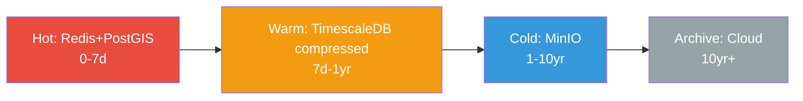

**TimescaleDB lifecycle:**

| Table                        | Chunk | Compress | Retention |
| ---------------------------- | ----- | -------- | --------- |
| `eco_climate.observations` | 1 day | 7 days   | 5 years   |
| `eco_climate.forecasts`    | 1 day | 30 days  | 1 year    |
| `eco_health.air_quality`   | 1 day | 7 days   | 3 years   |

---

# 4. ML/AI Architecture

## 4.1 ML System Diagram

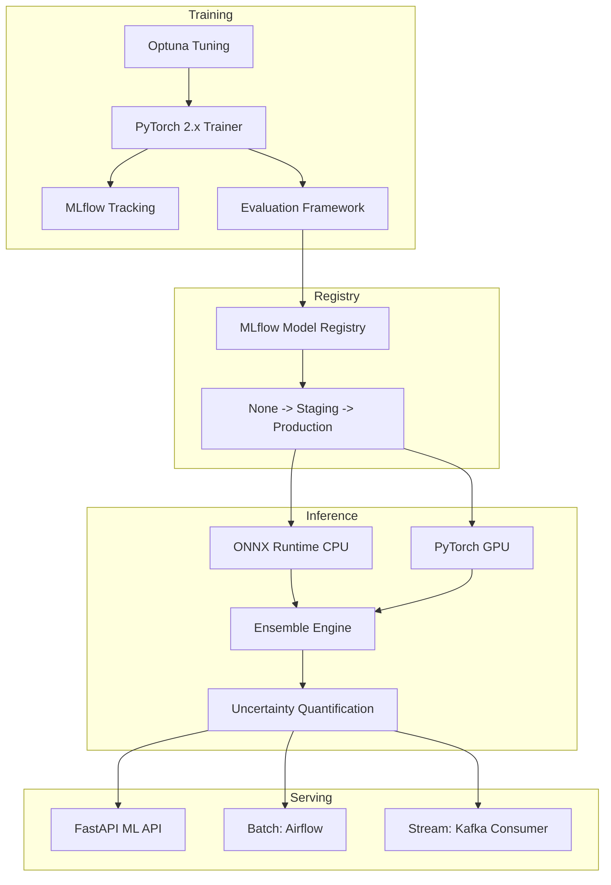

## 4.2 Model Registry — MLflow

**Naming:** `{domain}-{task}-{architecture}` — e.g., `climate-forecast-graphcast`, `biodiversity-sdm-hierarchical`

**Promotion:** `None` → `Staging` (shadow traffic) → `Production` (A/B) → `Archived`

### Promotion Sequence

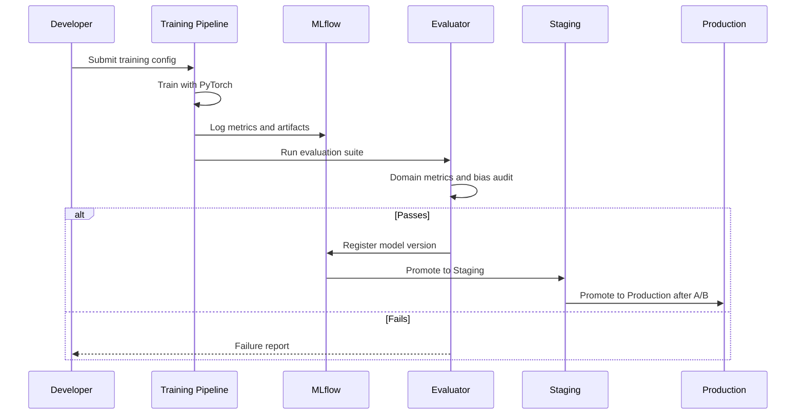

## 4.3 Training Pipeline

```python
# packages/ml/src/ecotrack_ml/training/trainer.py
from dataclasses import dataclass, field
from typing import Protocol
import torch
from torch.utils.data import DataLoader

@dataclass
class TrainingConfig:
    model_name: str
    domain: str
    architecture: str
    dataset_version: str
    epochs: int = 100
    batch_size: int = 32
    learning_rate: float = 1e-4
    weight_decay: float = 1e-5
    scheduler: str = "cosine"       # cosine, linear, step
    warmup_steps: int = 1000
    device: str = "auto"            # auto, cpu, cuda, mps
    precision: str = "bf16-mixed"   # fp32, fp16-mixed, bf16-mixed
    compile_model: bool = True      # torch.compile
    h3_resolution: int = 7
    eval_interval: int = 5
    early_stopping_patience: int = 10
    tags: dict[str, str] = field(default_factory=dict)

class ModelProtocol(Protocol):
    """Interface all EcoTrack models must implement."""
    def forward(self, batch: dict[str, torch.Tensor]) -> dict[str, torch.Tensor]: ...
    def compute_loss(self, preds: dict[str, torch.Tensor],
                     targets: dict[str, torch.Tensor]) -> torch.Tensor: ...
    def predict(self, inputs: dict[str, torch.Tensor]) -> dict[str, torch.Tensor]: ...

class EcoTrackTrainer:
    def __init__(self, model: ModelProtocol, config: TrainingConfig,
                 train_loader: DataLoader, val_loader: DataLoader) -> None: ...
    def train(self) -> dict: ...
    def evaluate(self) -> dict[str, float]: ...
    def export_onnx(self, output_path: str) -> str: ...
```

## 4.4 Inference Architecture

| Mode          | Engine            | Latency | Use Case             |
| ------------- | ----------------- | ------- | -------------------- |
| Real-time     | ONNX Runtime CPU  | <500ms  | API requests         |
| GPU real-time | PyTorch CUDA      | <2s     | Complex inference    |
| Batch         | Airflow + PyTorch | Hours   | Regional predictions |
| Streaming     | Kafka + ONNX      | <5s     | Event-driven         |

```python
# packages/ml/src/ecotrack_ml/inference/engine.py
from pathlib import Path
import numpy as np
import onnxruntime as ort

class ONNXInferenceEngine:
    def __init__(self, model_path: Path, num_threads: int = 4) -> None:
        opts = ort.SessionOptions()
        opts.intra_op_num_threads = num_threads
        opts.graph_optimization_level = ort.GraphOptimizationLevel.ORT_ENABLE_ALL
        self.session = ort.InferenceSession(
            str(model_path), opts, providers=["CPUExecutionProvider"])
        self.input_names = [i.name for i in self.session.get_inputs()]
        self.output_names = [o.name for o in self.session.get_outputs()]

    def predict(self, inputs: dict[str, np.ndarray]) -> dict[str, np.ndarray]:
        results = self.session.run(self.output_names, inputs)
        return dict(zip(self.output_names, results))
```

## 4.5 Ensemble and Uncertainty

```python
# packages/ml/src/ecotrack_ml/inference/ensemble.py
from dataclasses import dataclass
import numpy as np

@dataclass
class EnsembleMember:
    model_name: str
    weight: float
    engine: object  # ONNXInferenceEngine

class EnsembleEngine:
    """Weighted ensemble with uncertainty estimation."""
    def __init__(self, members: list[EnsembleMember]) -> None:
        self.members = members
        total = sum(m.weight for m in members)
        for m in members: m.weight /= total

    def predict(self, inputs: dict[str, np.ndarray]) -> dict[str, np.ndarray]:
        preds = [m.engine.predict(inputs) for m in self.members]
        result = {}
        for key in preds[0]:
            stacked = np.stack([p[key] for p in preds])
            weighted = np.stack([p[key]*m.weight for p, m in zip(preds, self.members)])
            result[key] = np.sum(weighted, axis=0)
            result[f"{key}_std"] = np.std(stacked, axis=0)
            result[f"{key}_p10"] = np.percentile(stacked, 10, axis=0)
            result[f"{key}_p90"] = np.percentile(stacked, 90, axis=0)
        return result
```

## 4.6 Feature Store

| Feature Set            | Entity  | Key Features                                     | Refresh |
| ---------------------- | ------- | ------------------------------------------------ | ------- |
| `climate_grid_daily` | H3 cell | temp, precip, wind, humidity, NDVI, elevation    | Daily   |
| `biodiversity_cell`  | H3 cell | species_richness, habitat_quality, fragmentation | Weekly  |
| `health_exposure`    | H3 cell | pm25, no2, o3, temperature                       | Hourly  |
| `crop_monitoring`    | H3 cell | NDVI, soil_moisture, rainfall                    | Weekly  |
| `equity_indicators`  | H3 cell | pollution, socioeconomic, health_access          | Monthly |

---

# 5. API Architecture

## 5.1 API Layer Diagram

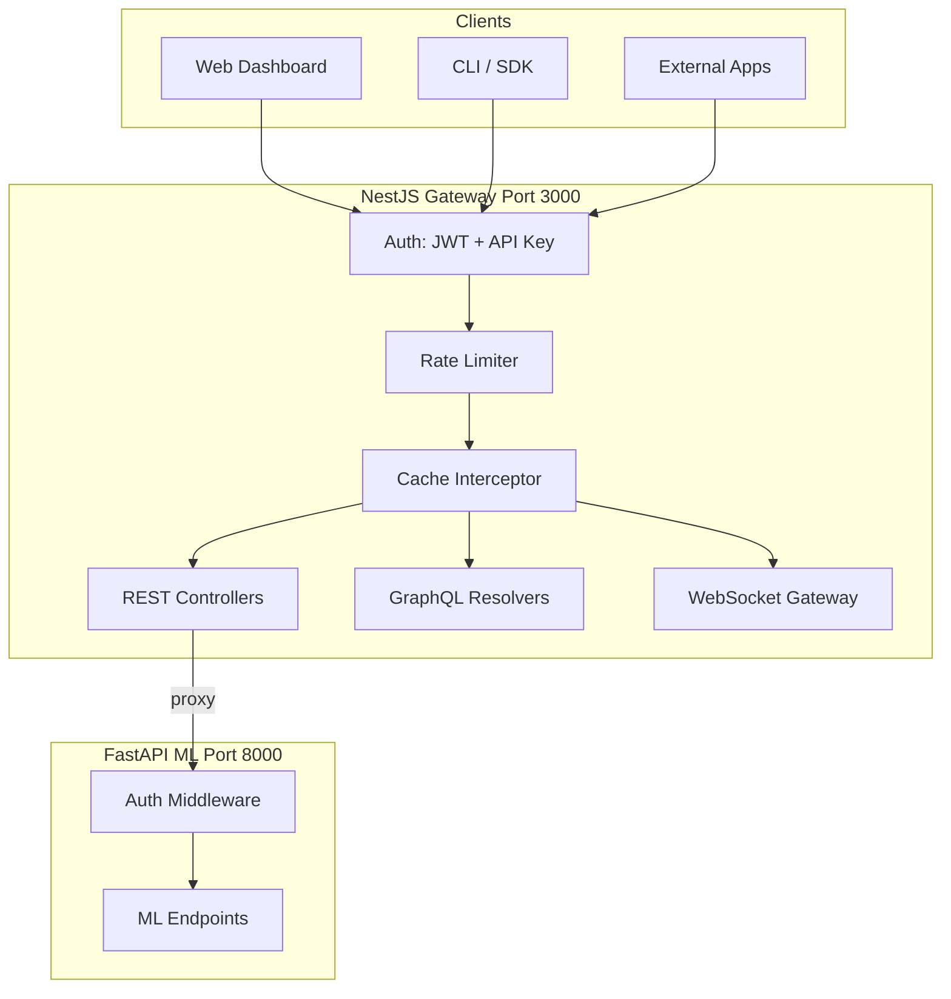

## 5.2 Endpoint Taxonomy

### Climate — `/api/v1/climate`

| Method | Path                              | Description                      |
| ------ | --------------------------------- | -------------------------------- |
| GET    | `/observations`                 | Query by H3, time, variable      |
| GET    | `/observations/{h3}/timeseries` | Time series for a cell           |
| GET    | `/forecasts`                    | Weather forecasts 1-14 day       |
| GET    | `/anomalies`                    | Detected anomalies               |
| GET    | `/scenarios`                    | CMIP6 SSP projections            |
| POST   | `/scenarios/explore`            | Interactive scenario exploration |
| GET    | `/downscaling/{h3}`             | Downscaled climate data          |

### Biodiversity — `/api/v1/biodiversity`

| Method | Path                           | Description        |
| ------ | ------------------------------ | ------------------ |
| GET    | `/species`                   | Species search     |
| GET    | `/species/{id}/distribution` | Distribution map   |
| GET    | `/occurrences`               | Occurrence records |
| GET    | `/habitat/{h3}`              | Habitat quality    |
| GET    | `/deforestation/alerts`      | Forest loss alerts |

### Health — `/api/v1/health`

| Method | Path                           | Description         |
| ------ | ------------------------------ | ------------------- |
| GET    | `/air-quality`               | AQ observations     |
| GET    | `/air-quality/{h3}/forecast` | AQ forecast         |
| GET    | `/vector-risk`               | Disease vector maps |

### Food — `/api/v1/food`

| Method | Path                 | Description       |
| ------ | -------------------- | ----------------- |
| GET    | `/crop-monitoring` | Crop conditions   |
| GET    | `/yield-forecast`  | Yield predictions |
| GET    | `/drought-index`   | SPI/SPEI indices  |

### Equity — `/api/v1/equity`

| Method | Path                     | Description           |
| ------ | ------------------------ | --------------------- |
| GET    | `/justice-scores`      | Environmental justice |
| GET    | `/justice-scores/{h3}` | Score breakdown       |

### Cross-Cutting

| Method | Path                     | Description            |
| ------ | ------------------------ | ---------------------- |
| GET    | `/catalog/collections` | STAC collections       |
| GET    | `/catalog/search`      | STAC item search       |
| POST   | `/agents/query`        | Agent natural language |
| GET    | `/alerts`              | Active alerts          |
| WS     | `/ws/alerts`           | Real-time alert stream |

### ML API (internal) — `/ml/v1`

| Method | Path                           | Description          |
| ------ | ------------------------------ | -------------------- |
| POST   | `/predict/climate/forecast`  | Forecast inference   |
| POST   | `/predict/biodiversity/sdm`  | Species distribution |
| POST   | `/predict/health/airquality` | AQ prediction        |
| POST   | `/predict/food/yield`        | Yield prediction     |
| GET    | `/models`                    | Deployed models list |
| GET    | `/models/{name}/info`        | Model card           |

## 5.3 Authentication and Authorization

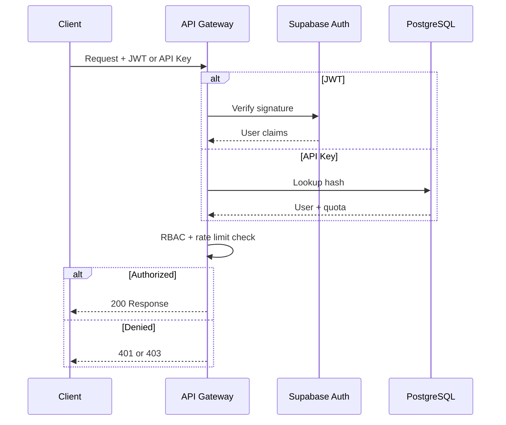

**Roles:** `viewer` (read public), `analyst` (read all + export + agents), `contributor` (write data), `admin` (full), `api_consumer` (programmatic)

**Rate limits:**

| Tier          | Req/min | Req/day |
| ------------- | ------- | ------- |
| free          | 30      | 1000    |
| researcher    | 120     | 10000   |
| institutional | 600     | 100000  |

## 5.4 GraphQL

```graphql
type Query {
  climateObservations(h3: String!, variable: String!,
    start: DateTime!, end: DateTime!): [ClimateObservation!]!
  speciesDistribution(speciesId: ID!, scenario: String): DistributionMap!
  agentQuery(question: String!, context: AgentContext): AgentResponse!
}

type AgentResponse {
  answer: String!
  sources: [Source!]!
  confidence: Float!
  visualizations: [Visualization!]
}
```

## 5.5 WebSocket Real-Time

```typescript
// apps/api/src/websocket/alerts.gateway.ts
@WebSocketGateway({ namespace: '/ws/alerts' })
export class AlertsGateway {
  @SubscribeMessage('subscribe')
  handleSubscribe(
    @MessageBody() data: { domains: string[]; severity: string[] },
    @ConnectedSocket() client: Socket,
  ) {
    for (const d of data.domains)
      for (const s of data.severity)
        client.join(`alerts:${d}:${s}`);
  }

  broadcastAlert(alert: AlertDto) {
    this.server
      .to(`alerts:${alert.domain}:${alert.severity}`)
      .emit('alert', alert);
  }
}
```

---

# 6. Event-Driven Architecture

## 6.1 Topic Design

| Topic                                 | Partition Key | Producers        | Consumers   |
| ------------------------------------- | ------------- | ---------------- | ----------- |
| `ecotrack.ingest.satellite`         | H3 res-3      | STAC Harvester   | ETL Workers |
| `ecotrack.ingest.weather`           | H3 res-3      | CDS Poller       | ETL Workers |
| `ecotrack.ingest.biodiversity`      | H3 res-3      | GBIF Poller      | ETL Workers |
| `ecotrack.ingest.airquality`        | H3 res-3      | OpenAQ Poller    | ETL Workers |
| `ecotrack.data.processed`           | H3 res-3      | ETL Workers      | Feature Eng |
| `ecotrack.feature.computed`         | entity_id     | Feature Eng      | ML Pipeline |
| `ecotrack.climate.anomaly-detected` | H3 res-3      | Anomaly Detector | Alert Svc   |
| `ecotrack.model.training-completed` | model_name    | Training         | Registry    |
| `ecotrack.model.deployed`           | model_name    | Registry         | ML API      |
| `ecotrack.alert.created`            | domain        | All Services     | WS Gateway  |

## 6.2 Event Schemas

```python
# packages/core/src/ecotrack_core/events/schemas.py
from dataclasses import dataclass, field
from datetime import datetime
from typing import Optional

@dataclass
class EventEnvelope:
    event_id: str
    event_type: str
    timestamp: datetime
    source: str
    correlation_id: Optional[str] = None
    h3_index: Optional[str] = None

@dataclass
class SatelliteDataIngested:
    envelope: EventEnvelope
    stac_item_id: str
    collection_id: str
    bbox: list[float]
    h3_cells: list[str]
    bands: list[str]
    cloud_cover_pct: Optional[float] = None

@dataclass
class AnomalyDetected:
    envelope: EventEnvelope
    domain: str
    variable: str
    h3_index: str
    anomaly_score: float
    observed_value: float
    baseline_mean: float
    baseline_std: float
    severity: str  # info, warning, critical

@dataclass
class TrainingCompleted:
    envelope: EventEnvelope
    model_name: str
    model_version: str
    mlflow_run_id: str
    metrics: dict[str, float]
    dataset_version: str
    duration_seconds: float

@dataclass
class ModelDeployed:
    envelope: EventEnvelope
    model_name: str
    model_version: str
    stage: str
    endpoint_url: str
    replaced_version: Optional[str] = None
```

## 6.3 Event Flow — Satellite Data Arrives

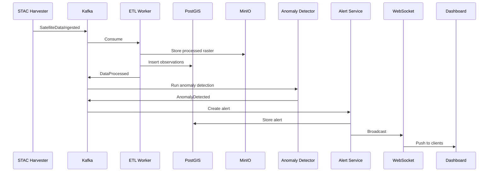

## 6.4 Event Flow — Model Retraining

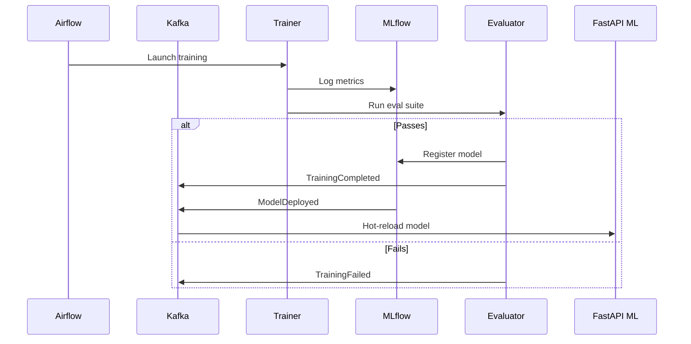

## 6.5 Event Flow — User Agent Query

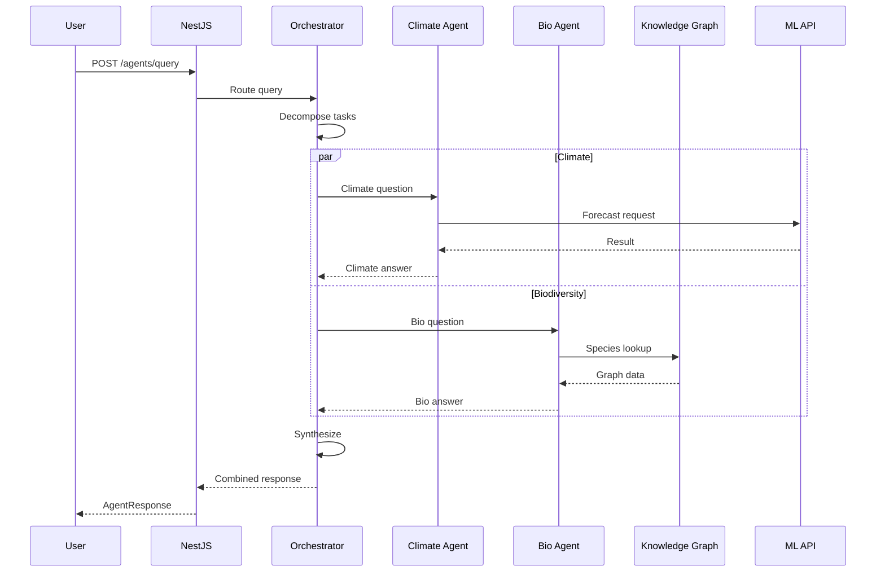

---

# 7. Multi-Agent System Architecture

## 7.1 Agent Architecture

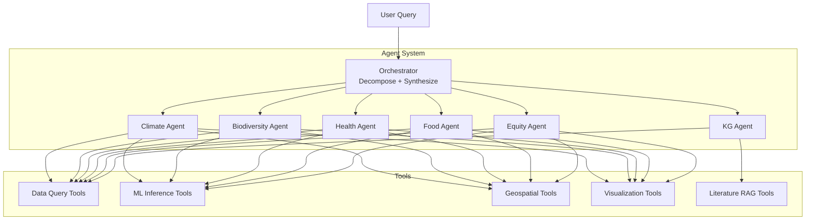

## 7.2 Agent Roles

| Agent                  | LLM             | Key Tools                          | Domain Knowledge                  |
| ---------------------- | --------------- | ---------------------------------- | --------------------------------- |
| **Orchestrator** | GPT-4o / Claude | Planning, synthesis                | Cross-domain routing              |
| **Climate**      | Domain-tuned    | ERA5 query, forecast, downscaling  | Weather, projections, attribution |
| **Biodiversity** | Domain-tuned    | GBIF query, SDM, change detection  | Species, habitat, conservation    |
| **Health**       | Domain-tuned    | OpenAQ query, AQ models            | Air quality, disease vectors      |
| **Food**         | Domain-tuned    | NDVI query, yield models           | Crops, drought, food security     |
| **Equity**       | Domain-tuned    | Census query, optimization         | Justice scores, allocation        |
| **KG**           | GPT-4o / Claude | Cypher query, Semantic Scholar RAG | Ontology, literature              |

## 7.3 Communication Protocol

```python
# packages/agents/src/ecotrack_agents/protocols/messages.py
from dataclasses import dataclass, field
from datetime import datetime
from typing import Optional, Any
from enum import Enum

class MessageType(Enum):
    TASK = "task"
    RESULT = "result"
    ERROR = "error"
    CLARIFICATION = "clarification"

@dataclass
class AgentMessage:
    sender: str
    receiver: str
    message_type: MessageType
    content: str
    correlation_id: str
    timestamp: datetime = field(default_factory=datetime.utcnow)
    metadata: dict[str, Any] = field(default_factory=dict)
    confidence: Optional[float] = None
    sources: list[str] = field(default_factory=list)

@dataclass
class AgentTask:
    task_id: str
    query: str
    domain: str
    spatial_context: Optional[dict] = None
    temporal_context: Optional[dict] = None

@dataclass
class AgentResult:
    task_id: str
    answer: str
    confidence: float
    sources: list[dict]
    data: Optional[dict] = None
    visualizations: list[dict] = field(default_factory=list)
```

## 7.4 Orchestration Pattern

Uses **hierarchical orchestration** via LangGraph:

1. Receive user query
2. **Plan:** decompose into domain-specific sub-tasks
3. **Execute:** domain agents run concurrently with tools
4. **Reflect:** evaluate sub-results for consistency
5. **Synthesize:** combine into coherent response with uncertainty
6. **Cite:** attach sources and provenance

## 7.5 Tool Registry

```python
# packages/agents/src/ecotrack_agents/tools/registry.py
from dataclasses import dataclass
from typing import Callable, Any

@dataclass
class ToolDefinition:
    name: str
    description: str
    parameters: dict[str, Any]
    function: Callable
    domains: list[str]
    timeout_seconds: int = 30

TOOL_REGISTRY: dict[str, ToolDefinition] = {
    "query_climate_observations": ToolDefinition(
        name="query_climate_observations",
        description="Query climate observations by H3 cell, variable, time",
        parameters={"h3_index": "str", "variable": "str",
                    "start_time": "datetime", "end_time": "datetime"},
        function=None, domains=["climate", "health", "food"]),
    "run_species_distribution_model": ToolDefinition(
        name="run_species_distribution_model",
        description="Run SDM for a species under current or projected climate",
        parameters={"species_id": "str", "scenario": "str", "year": "int"},
        function=None, domains=["biodiversity"]),
    "query_knowledge_graph": ToolDefinition(
        name="query_knowledge_graph",
        description="Execute Cypher query on environmental knowledge graph",
        parameters={"query": "str", "params": "dict"},
        function=None, domains=["knowledge_graph", "climate", "biodiversity"]),
    "generate_map_visualization": ToolDefinition(
        name="generate_map_visualization",
        description="Generate a map from geospatial data",
        parameters={"data": "GeoJSON", "style": "dict"},
        function=None, domains=["climate", "biodiversity", "health", "food", "equity"]),
}
```

---

# 8. Security Architecture

## 8.1 Authentication Flow

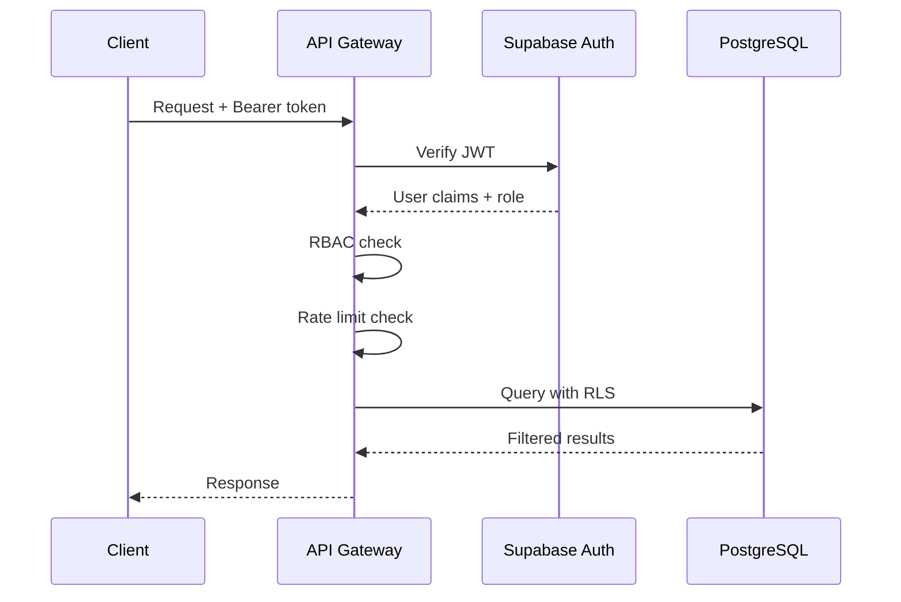

## 8.2 Security Layers

| Layer            | Mechanism         | Technology                       |
| ---------------- | ----------------- | -------------------------------- |
| Transport        | TLS 1.3           | Cert-manager, Let's Encrypt      |
| Authentication   | JWT + API keys    | Supabase Auth                    |
| Authorization    | RBAC + RLS        | NestJS Guards + PostgreSQL RLS   |
| Input Validation | Schema validation | Pydantic + class-validator       |
| Rate Limiting    | Token bucket      | Redis-backed                     |
| API Security     | OWASP Top 10      | Helmet, CORS, CSP                |
| Data at Rest     | AES-256           | PostgreSQL TDE, MinIO encryption |
| Data in Transit  | TLS 1.3           | All inter-service                |
| Secrets          | Centralized       | K8s Secrets + Sealed Secrets     |
| Supply Chain     | Scan              | Dependabot, Trivy, Snyk          |

## 8.3 RBAC Model

```python
# packages/core/src/ecotrack_core/auth/rbac.py
from enum import Enum

class Permission(Enum):
    READ_PUBLIC = "read:public"
    READ_ALL = "read:all"
    WRITE_DATA = "write:data"
    RUN_ANALYSIS = "run:analysis"
    MANAGE_MODELS = "manage:models"
    EXPORT_DATA = "export:data"
    QUERY_AGENTS = "query:agents"
    ADMIN = "admin:all"

ROLE_PERMISSIONS: dict[str, set[Permission]] = {
    "viewer":      {Permission.READ_PUBLIC},
    "analyst":     {Permission.READ_PUBLIC, Permission.READ_ALL,
                    Permission.RUN_ANALYSIS, Permission.EXPORT_DATA,
                    Permission.QUERY_AGENTS},
    "contributor": {Permission.READ_PUBLIC, Permission.READ_ALL,
                    Permission.WRITE_DATA, Permission.RUN_ANALYSIS},
    "admin":       {p for p in Permission},
    "api_consumer": {Permission.READ_PUBLIC, Permission.READ_ALL,
                     Permission.RUN_ANALYSIS},
}
```

## 8.4 Vulnerability Scanning Pipeline

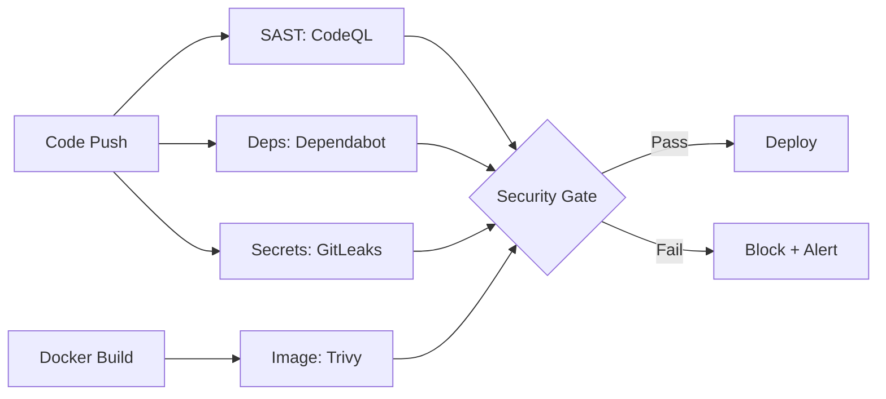

---

# 9. Observability Architecture

## 9.1 Stack Overview

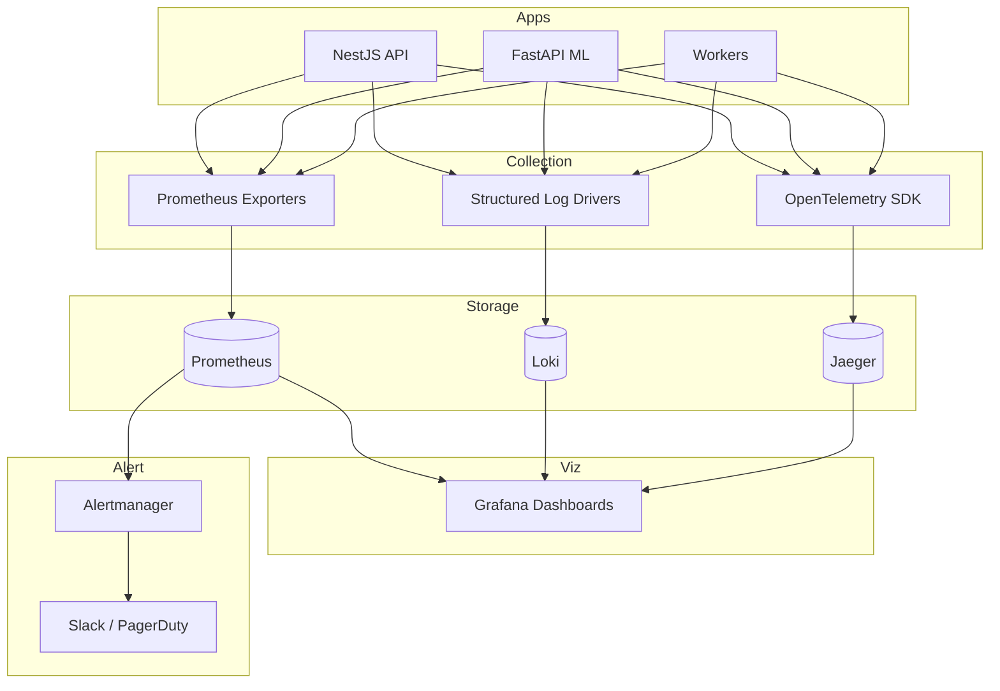

## 9.2 Key Metrics

| Category | Metric                            | Type      | Labels                   |
| -------- | --------------------------------- | --------- | ------------------------ |
| API      | `http_requests_total`           | Counter   | method, endpoint, status |
| API      | `http_request_duration_seconds` | Histogram | method, endpoint         |
| ML       | `ml_inference_duration_seconds` | Histogram | model_name, domain       |
| ML       | `ml_inference_total`            | Counter   | model_name, status       |
| Data     | `data_ingestion_events_total`   | Counter   | source, domain           |
| Data     | `data_ingestion_lag_seconds`    | Gauge     | source                   |
| Kafka    | `kafka_consumer_lag`            | Gauge     | topic, group             |
| Cache    | `cache_hit_ratio`               | Gauge     | cache_type               |
| DB       | `pg_active_connections`         | Gauge     | database                 |

## 9.3 Structured Logging Format

```json
{
  "timestamp": "2026-02-17T12:00:00Z",
  "level": "INFO",
  "service": "api-gateway",
  "trace_id": "abc123",
  "span_id": "def456",
  "user_id": "usr_789",
  "message": "Climate query completed",
  "duration_ms": 45,
  "h3_index": "872830828ffffff",
  "domain": "climate"
}
```

## 9.4 Distributed Tracing

W3C Trace Context propagation across all services:

```
Client -> NestJS API (span: http.request)
  -> Redis cache check (span: cache.get)
  -> FastAPI ML API (span: http.request)
    -> ONNX Runtime (span: ml.inference)
    -> PostgreSQL (span: db.query)
  -> Response assembly (span: response.build)
```

## 9.5 Alerting Rules

| Alert                | Condition                | Severity |
| -------------------- | ------------------------ | -------- |
| API Error Rate       | 5xx > 5% for 5m          | Critical |
| API Latency          | p95 > 2s for 10m         | Warning  |
| ML Inference Failure | Error > 10% for 5m       | Critical |
| Kafka Lag            | > 10K for 15m            | Warning  |
| Disk Usage           | > 85%                    | Warning  |
| DB Saturated         | Active > 80% max for 5m  | Critical |
| Ingestion Stale      | No events for 1h         | Warning  |
| Model Drift          | Metric degradation > 10% | Warning  |

## 9.6 Grafana Dashboards

| Dashboard                 | Panels                                                            |
| ------------------------- | ----------------------------------------------------------------- |
| **API Overview**    | Request rate, latency percentiles, error rate, active connections |
| **ML Performance**  | Inference latency, model accuracy drift, GPU utilization          |
| **Data Pipeline**   | Ingestion rate, Kafka lag, processing time, data quality scores   |
| **Infrastructure**  | CPU, memory, disk, network per service                            |
| **Domain: Climate** | Anomaly count, forecast accuracy, observation coverage            |

---

# 10. Deployment Architecture

## 10.1 Environment Tiers

| Tier                 | Infrastructure  | Stack           | Users       |
| -------------------- | --------------- | --------------- | ----------- |
| **Local Dev**  | Docker Compose  | Full or minimal | 1 developer |
| **Staging**    | Single-node K8s | Full stack      | QA team     |
| **Production** | Multi-node K8s  | Full + HA       | All users   |

## 10.2 Docker Compose — Local Development

```yaml
# infrastructure/docker/docker-compose.yml (simplified)
services:
  postgres:
    image: timescale/timescaledb-ha:pg16
    environment:
      POSTGRES_DB: ecotrack
      POSTGRES_PASSWORD: ecotrack_dev
    ports: ["5432:5432"]
    volumes: [postgres_data:/home/postgres/pgdata]

  redis:
    image: redis:7-alpine
    ports: ["6379:6379"]

  neo4j:
    image: neo4j:5-community
    ports: ["7474:7474", "7687:7687"]
    environment:
      NEO4J_AUTH: neo4j/ecotrack_dev

  minio:
    image: minio/minio:latest
    command: server /data --console-address ":9001"
    ports: ["9000:9000", "9001:9001"]

  kafka:
    image: bitnami/kafka:3.7
    ports: ["9092:9092"]
    environment:
      KAFKA_CFG_NODE_ID: 0
      KAFKA_CFG_PROCESS_ROLES: broker,controller
      KAFKA_CFG_CONTROLLER_QUORUM_VOTERS: 0@kafka:9093

  api:
    build: { context: ../.., dockerfile: apps/api/Dockerfile }
    ports: ["3000:3000"]
    depends_on: [postgres, redis]

  ml-api:
    build: { context: ../.., dockerfile: apps/ml-api/Dockerfile }
    ports: ["8000:8000"]
    depends_on: [redis]

  web:
    build: { context: ../.., dockerfile: apps/web/Dockerfile }
    ports: ["3001:3000"]
    depends_on: [api]

  worker:
    build: { context: ../.., dockerfile: apps/worker/Dockerfile }
    depends_on: [kafka, postgres, redis]

  airflow:
    image: apache/airflow:2.8
    ports: ["8080:8080"]

  mlflow:
    image: ghcr.io/mlflow/mlflow:2.11
    ports: ["5000:5000"]

  prometheus:
    image: prom/prometheus:v2.50
    ports: ["9090:9090"]

  grafana:
    image: grafana/grafana:10.3
    ports: ["3002:3000"]

  loki:
    image: grafana/loki:2.9
    ports: ["3100:3100"]
```

## 10.3 Kubernetes — Production

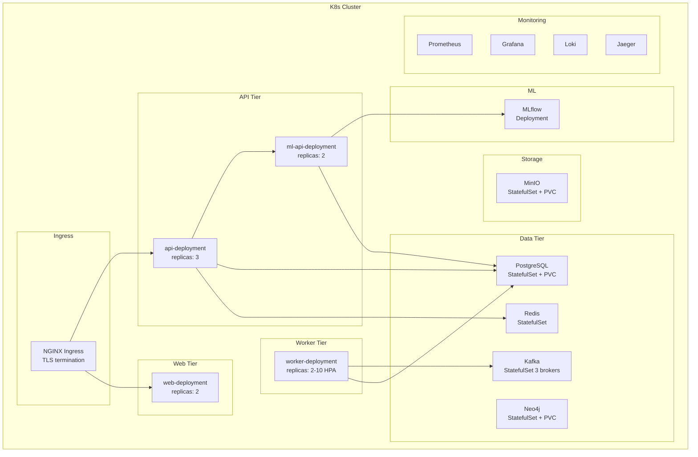

**Scaling strategy:**

| Service | Min | Max | Trigger                                    |
| ------- | --- | --- | ------------------------------------------ |
| api     | 3   | 20  | CPU > 70% or request latency p95 > 500ms   |
| ml-api  | 2   | 10  | GPU utilization > 80% or queue depth > 100 |
| worker  | 2   | 10  | Kafka consumer lag > 5000                  |
| web     | 2   | 5   | CPU > 70%                                  |

## 10.4 CI/CD Pipeline

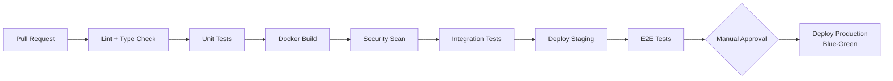

**GitHub Actions workflow stages:**

| Stage             | Tools                               | Gate                |
| ----------------- | ----------------------------------- | ------------------- |
| Lint + Types      | ESLint, Prettier, mypy, pyright     | Must pass           |
| Unit Tests        | Jest, pytest                        | Coverage > 80%      |
| Docker Build      | Multi-stage builds, layer caching   | Must succeed        |
| Security          | CodeQL, Trivy, GitLeaks, Dependabot | Zero critical vulns |
| Integration       | Docker Compose test stack           | Must pass           |
| E2E               | Playwright (browser), k6 (load)     | Must pass           |
| Staging Deploy    | Kustomize overlay                   | Auto after tests    |
| Production Deploy | Blue-green via Helm                 | Manual approval     |

## 10.5 Blue-Green Deployment

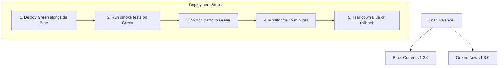

---

# 11. Interface Contracts

## 11.1 Data Pipeline → ML Engine

```python
# Interface: DataPipeline produces features; ML Engine consumes them

from dataclasses import dataclass
from datetime import datetime
import numpy as np

@dataclass
class FeatureVector:
    """Output from data pipeline, input to ML models."""
    entity_id: str               # H3 cell ID, species ID, etc.
    entity_type: str             # "h3_cell", "species", "region"
    feature_set: str             # "climate_grid_daily"
    timestamp: datetime
    values: dict[str, float]     # Named feature values
    embedding: np.ndarray | None # Optional pre-computed embedding (768-dim)

@dataclass
class TrainingDataset:
    """Dataset prepared by pipeline for ML training."""
    dataset_id: str
    name: str
    version: str
    feature_set: str
    split: str                   # "train", "val", "test"
    num_samples: int
    temporal_range: tuple[datetime, datetime]
    spatial_extent: dict         # GeoJSON bbox
    storage_path: str            # MinIO path
    checksum: str                # SHA256

@dataclass
class PredictionRequest:
    """ML Engine input for inference."""
    model_name: str
    model_version: str
    features: list[FeatureVector]
    return_uncertainty: bool = True

@dataclass
class PredictionResult:
    """ML Engine output from inference."""
    model_name: str
    model_version: str
    predictions: list[dict[str, float]]  # [{variable: value, ...}]
    uncertainty: list[dict[str, float]] | None  # [{variable_std, variable_p10, ...}]
    latency_ms: float
    mlflow_run_id: str
```

## 11.2 ML Engine → API Layer

```python
# Interface: ML API serves predictions; NestJS API Gateway consumes them

from pydantic import BaseModel, Field
from datetime import datetime

class MLPredictionRequest(BaseModel):
    """Request from API Gateway to ML API."""
    model_name: str
    domain: str
    h3_index: str
    variables: list[str]
    time_range: dict = Field(description="start and end datetime")
    scenario: str | None = None
    return_uncertainty: bool = True

class MLPredictionResponse(BaseModel):
    """Response from ML API to API Gateway."""
    model_name: str
    model_version: str
    h3_index: str
    predictions: list[dict]  # Time-indexed predictions
    uncertainty: dict | None  # Uncertainty bands
    metadata: dict = Field(default_factory=dict)
    latency_ms: float
    cached: bool = False

class ModelInfoResponse(BaseModel):
    """Model metadata for API consumers."""
    name: str
    version: str
    domain: str
    architecture: str
    description: str
    input_features: list[str]
    output_variables: list[str]
    metrics: dict[str, float]
    training_date: datetime
    dataset_version: str
```

## 11.3 API Layer → Web Dashboard

```typescript
// Interface: REST/GraphQL/WS responses consumed by Next.js

// Climate observation response
interface ClimateObservation {
  h3Index: string;
  observedAt: string;  // ISO 8601
  variable: string;
  value: number;
  unit: string;
  qualityFlag: number;
}

interface ClimateTimeSeries {
  h3Index: string;
  variable: string;
  unit: string;
  data: Array<{ timestamp: string; value: number }>;
  statistics: {
    mean: number;
    min: number;
    max: number;
    stdDev: number;
  };
}

// Forecast response
interface ForecastResponse {
  modelName: string;
  modelVersion: string;
  h3Index: string;
  variable: string;
  unit: string;
  forecasts: Array<{
    forecastTime: string;
    leadHours: number;
    valueMean: number;
    valueP10: number;
    valueP50: number;
    valueP90: number;
  }>;
}

// Alert via WebSocket
interface AlertEvent {
  id: string;
  alertType: string;
  domain: 'climate' | 'biodiversity' | 'health' | 'food' | 'equity';
  severity: 'info' | 'warning' | 'critical';
  title: string;
  description: string;
  h3Index: string;
  geometry: GeoJSON.Geometry;
  validFrom: string;
  validUntil: string | null;
  metadata: Record<string, unknown>;
}

// Agent query response
interface AgentQueryResponse {
  answer: string;
  confidence: number;
  sources: Array<{
    type: string;  // "dataset", "model", "literature", "knowledge_graph"
    name: string;
    url?: string;
  }>;
  visualizations: Array<{
    type: 'map' | 'chart' | 'table';
    data: unknown;
    config: Record<string, unknown>;
  }>;
  followUpQuestions: string[];
}

// Paginated list response
interface PaginatedResponse<T> {
  data: T[];
  pagination: {
    total: number;
    page: number;
    pageSize: number;
    totalPages: number;
  };
}
```

## 11.4 Knowledge Graph → Agents

```python
# Interface: KG provides structured knowledge to agent system

from dataclasses import dataclass

@dataclass
class GraphNode:
    """Node returned from Knowledge Graph query."""
    id: str
    labels: list[str]          # ["Species", "Endangered"]
    properties: dict[str, any]

@dataclass
class GraphRelationship:
    """Relationship returned from KG query."""
    id: str
    type: str                  # "CAUSES", "INHABITS", etc.
    source_id: str
    target_id: str
    properties: dict[str, any] # strength, lag, direction

@dataclass
class GraphQueryResult:
    """Result of a Cypher query against the KG."""
    nodes: list[GraphNode]
    relationships: list[GraphRelationship]
    paths: list[list[str]]     # Node ID sequences for path queries
    query_time_ms: float

@dataclass
class KGSearchResult:
    """Semantic search result from KG embeddings."""
    entity: GraphNode
    similarity_score: float    # 0-1 cosine similarity
    context: str               # Surrounding graph context as text

class KnowledgeGraphInterface:
    """Port that agents use to query the knowledge graph."""
    def query_cypher(self, query: str, params: dict = None) -> GraphQueryResult: ...
    def semantic_search(self, query: str, top_k: int = 10) -> list[KGSearchResult]: ...
    def get_neighbors(self, node_id: str, rel_types: list[str] = None,
                      max_depth: int = 2) -> GraphQueryResult: ...
    def get_causal_chain(self, source: str, target: str) -> list[GraphRelationship]: ...
```

## 11.5 Agents → RL Policy Engine (v2.0+)

```python
# Interface: Agents request policy optimization; RL engine returns recommendations

from dataclasses import dataclass, field

@dataclass
class PolicyOptimizationRequest:
    """Request from agent to RL policy engine."""
    domain: str                    # "water", "conservation", "energy"
    scenario_id: str
    objectives: list[dict]         # [{"name": "yield", "direction": "maximize"}]
    constraints: list[dict]        # [{"name": "budget", "max": 1000000}]
    state: dict[str, float]        # Current state variables
    time_horizon: int              # Steps to optimize over
    equity_weight: float = 0.5     # Weight for equity objective

@dataclass
class PolicyRecommendation:
    """RL engine output: recommended actions with trade-offs."""
    actions: list[dict[str, float]]  # Sequence of actions
    expected_outcomes: dict[str, float]
    pareto_alternatives: list[dict]  # Alternative solutions on Pareto frontier
    confidence: float
    equity_impact: dict[str, float]
    explanation: str               # Natural language explanation
```

## 11.6 Interface Summary Diagram

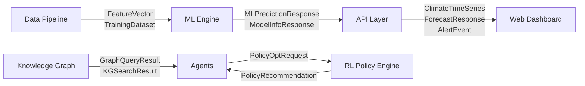

---

# 12. Configuration Management

## 12.1 Environment-Based Configuration

```yaml
# configs/default.yaml — Base configuration, all environments
app:
  name: ecotrack
  version: "1.0.0"
  log_level: INFO

database:
  host: localhost
  port: 5432
  name: ecotrack
  pool_size: 20
  extensions:
    - postgis
    - timescaledb
    - pgvector

redis:
  host: localhost
  port: 6379
  db: 0
  ttl_default_seconds: 300

kafka:
  bootstrap_servers: "localhost:9092"
  schema_registry_url: "http://localhost:8081"
  consumer_group_prefix: "ecotrack"
  default_partitions: 12
  replication_factor: 1

neo4j:
  uri: "bolt://localhost:7687"
  database: ecotrack

minio:
  endpoint: "localhost:9000"
  bucket: ecotrack-bucket
  secure: false

mlflow:
  tracking_uri: "http://localhost:5000"
  artifact_root: "s3://ecotrack-bucket/models/mlflow-artifacts"

api:
  port: 3000
  cors_origins: ["http://localhost:3001"]
  rate_limit:
    free: { rpm: 30, rpd: 1000 }
    researcher: { rpm: 120, rpd: 10000 }
    institutional: { rpm: 600, rpd: 100000 }

ml_api:
  port: 8000
  model_cache_dir: "/tmp/models"
  default_inference_timeout_ms: 5000

h3:
  default_resolution: 7
  partition_resolution: 3
  cache_resolution: 5
```

```yaml
# configs/production.yaml — Production overrides
app:
  log_level: WARN

database:
  host: ${DB_HOST}
  port: ${DB_PORT}
  password: ${DB_PASSWORD}
  pool_size: 100
  ssl: true

redis:
  host: ${REDIS_HOST}
  cluster_mode: true

kafka:
  bootstrap_servers: ${KAFKA_BROKERS}
  replication_factor: 3

neo4j:
  uri: ${NEO4J_URI}
  password: ${NEO4J_PASSWORD}

minio:
  endpoint: ${S3_ENDPOINT}
  secure: true

api:
  cors_origins: ["https://ecotrack.earth"]
  rate_limit:
    free: { rpm: 30, rpd: 1000 }
```

## 12.2 Feature Flags

```python
# packages/core/src/ecotrack_core/config/feature_flags.py
from dataclasses import dataclass
from enum import Enum

class FlagStatus(Enum):
    OFF = "off"
    ON = "on"
    PERCENTAGE = "percentage"  # Gradual rollout

@dataclass
class FeatureFlag:
    name: str
    status: FlagStatus
    percentage: float = 0.0    # For gradual rollout
    description: str = ""
    domains: list[str] = None  # Restrict to specific domains

# Feature flag definitions
FEATURE_FLAGS: dict[str, FeatureFlag] = {
    # Climate domain
    "FF_CLIMATE_GRAPHCAST_ENSEMBLE": FeatureFlag(
        name="FF_CLIMATE_GRAPHCAST_ENSEMBLE",
        status=FlagStatus.OFF,
        description="Enable GraphCast in weather forecast ensemble"),
    "FF_CLIMATE_DOWNSCALING_V2": FeatureFlag(
        name="FF_CLIMATE_DOWNSCALING_V2",
        status=FlagStatus.OFF,
        description="Use CorrDiff for downscaling instead of BCSD"),
    "FF_CLIMATE_SCENARIO_EXPLORER": FeatureFlag(
        name="FF_CLIMATE_SCENARIO_EXPLORER",
        status=FlagStatus.ON,
        description="Interactive SSP scenario explorer"),

    # Agent system
    "FF_AGENTS_ENABLED": FeatureFlag(
        name="FF_AGENTS_ENABLED",
        status=FlagStatus.PERCENTAGE,
        percentage=25.0,
        description="Multi-agent query system"),
    "FF_AGENTS_CROSS_DOMAIN": FeatureFlag(
        name="FF_AGENTS_CROSS_DOMAIN",
        status=FlagStatus.OFF,
        description="Allow cross-domain agent queries"),

    # Data pipeline
    "FF_PIPELINE_SENTINEL2_REALTIME": FeatureFlag(
        name="FF_PIPELINE_SENTINEL2_REALTIME",
        status=FlagStatus.ON,
        description="Real-time Sentinel-2 ingestion pipeline"),

    # UI features
    "FF_UI_3D_TERRAIN": FeatureFlag(
        name="FF_UI_3D_TERRAIN",
        status=FlagStatus.OFF,
        description="3D terrain rendering in map view"),
}
```

Feature flags are stored in Redis for fast lookup and updated via admin API or config file reload.

## 12.3 Model Configuration

```yaml
# configs/models.yaml — ML model deployment configuration
models:
  climate-forecast-graphcast:
    version: "1.0.0"
    stage: production
    engine: onnx
    path: "models/onnx/climate-forecast-graphcast/1.0.0/model.onnx"
    input_variables: ["temperature_2m", "geopotential_500", "u_wind_10m", "v_wind_10m"]
    output_variables: ["temperature_2m", "precipitation", "wind_speed"]
    lead_times_hours: [6, 12, 24, 48, 72, 120, 168, 240, 336]
    inference_timeout_ms: 2000
    batch_size: 1
    ensemble_weight: 0.4

  climate-forecast-fourcastnet:
    version: "1.0.0"
    stage: production
    engine: onnx
    path: "models/onnx/climate-forecast-fourcastnet/1.0.0/model.onnx"
    input_variables: ["temperature_2m", "geopotential_500"]
    output_variables: ["temperature_2m", "precipitation"]
    lead_times_hours: [6, 12, 24, 48, 72, 120]
    inference_timeout_ms: 1500
    ensemble_weight: 0.3

  climate-downscaling-bcsd:
    version: "1.0.0"
    stage: production
    engine: python
    module: "ecotrack_ml.models.climate.downscaling"
    input_resolution_km: 100
    output_resolution_km: 1
    variables: ["temperature", "precipitation"]

  biodiversity-sdm-hierarchical:
    version: "0.9.0"
    stage: staging
    engine: onnx
    path: "models/onnx/biodiversity-sdm-hierarchical/0.9.0/model.onnx"
    input_features: ["bioclim_1_19", "elevation", "land_cover", "ndvi"]
    output: "occurrence_probability"

  health-airquality-graphnn:
    version: "1.0.0"
    stage: production
    engine: pytorch
    path: "models/checkpoints/health-airquality-graphnn/1.0.0/"
    pollutants: ["pm25", "no2", "o3"]
    forecast_hours: [1, 6, 12, 24, 48]
```

## 12.4 Data Source Configuration

```yaml
# configs/data_sources.yaml
sources:
  era5:
    type: api
    provider: ECMWF CDS
    endpoint: "https://cds.climate.copernicus.eu/api/v2"
    auth_type: api_key
    variables:
      - "2m_temperature"
      - "total_precipitation"
      - "10m_u_component_of_wind"
      - "10m_v_component_of_wind"
    temporal_resolution: hourly
    spatial_resolution_deg: 0.25
    schedule: "0 */6 * * *"  # Every 6 hours
    max_concurrent_requests: 5
    retry_policy: { max_retries: 3, backoff_seconds: 60 }

  sentinel2:
    type: stac
    provider: Copernicus Data Space
    stac_api_url: "https://catalogue.dataspace.copernicus.eu/stac"
    collection: "sentinel-2-l2a"
    bands: ["B02", "B03", "B04", "B08", "B11", "B12", "SCL"]
    max_cloud_cover_pct: 30
    schedule: "0 */2 * * *"  # Every 2 hours
    spatial_filter: null  # Global, filtered by active regions

  gbif:
    type: api
    provider: GBIF
    endpoint: "https://api.gbif.org/v1"
    datasets:
      - "occurrence/search"
    schedule: "0 0 * * 0"  # Weekly
    taxa_filter: ["Aves", "Mammalia", "Amphibia"]
    country_filter: null  # Global

  openaq:
    type: api
    provider: OpenAQ
    endpoint: "https://api.openaq.org/v3"
    parameters: ["pm25", "pm10", "no2", "o3", "so2", "co"]
    schedule: "*/15 * * * *"  # Every 15 minutes
    spatial_filter: null

  modis_firms:
    type: api
    provider: NASA FIRMS
    endpoint: "https://firms.modaps.eosdis.nasa.gov/api"
    products: ["VIIRS_SNPP_NRT"]
    schedule: "*/30 * * * *"  # Every 30 minutes
```

---

# Appendix A: Technology Version Matrix

| Technology               | Version       | Role                      | License                |
| ------------------------ | ------------- | ------------------------- | ---------------------- |
| **TypeScript**     | 5.3+          | API, frontend language    | Apache 2.0             |
| **Python**         | 3.11+         | ML, data, agents language | PSF                    |
| **Node.js**        | 20 LTS        | TS runtime                | MIT                    |
| **NestJS**         | 10.x          | API gateway framework     | MIT                    |
| **Next.js**        | 15.x          | Web dashboard framework   | MIT                    |
| **FastAPI**        | 0.110+        | ML API framework          | MIT                    |
| **PyTorch**        | 2.2+          | Deep learning framework   | BSD                    |
| **PostgreSQL**     | 16.x          | Primary database          | PostgreSQL             |
| **PostGIS**        | 3.4+          | Geospatial extension      | GPL v2                 |
| **TimescaleDB**    | 2.14+         | Time-series extension     | Apache 2.0 (community) |
| **pgvector**       | 0.6+          | Vector search extension   | PostgreSQL             |
| **Neo4j**          | 5.x Community | Knowledge graph           | GPL v3                 |
| **Redis**          | 7.x           | Cache, pub/sub            | BSD-3                  |
| **Apache Kafka**   | 3.7+          | Event bus                 | Apache 2.0             |
| **Apache Airflow** | 2.8+          | Workflow orchestration    | Apache 2.0             |
| **MLflow**         | 2.11+         | ML experiment tracking    | Apache 2.0             |
| **MinIO**          | Latest        | Object storage            | AGPL v3                |
| **ONNX Runtime**   | 1.17+         | Model inference           | MIT                    |
| **MapLibre GL JS** | 4.x           | Map rendering             | BSD-3                  |
| **deck.gl**        | 9.x           | Geospatial visualization  | MIT                    |
| **Apache ECharts** | 5.x           | Charting                  | Apache 2.0             |
| **LangGraph**      | 0.1+          | Agent orchestration       | MIT                    |
| **Prometheus**     | 2.50+         | Metrics                   | Apache 2.0             |
| **Grafana**        | 10.3+         | Dashboards                | AGPL v3                |
| **Loki**           | 2.9+          | Log aggregation           | AGPL v3                |
| **OpenTelemetry**  | 1.x           | Distributed tracing       | Apache 2.0             |
| **Jaeger**         | 1.54+         | Trace storage/UI          | Apache 2.0             |
| **Docker**         | 25+           | Containerization          | Apache 2.0             |
| **Kubernetes**     | 1.29+         | Container orchestration   | Apache 2.0             |
| **Terraform**      | 1.7+          | Infrastructure as code    | BUSL 1.1               |
| **Helm**           | 3.14+         | K8s package manager       | Apache 2.0             |

---

# Appendix B: Glossary

| Term                 | Definition                                                               |
| -------------------- | ------------------------------------------------------------------------ |
| **CQRS**       | Command Query Responsibility Segregation — separate read/write models   |
| **COG**        | Cloud-Optimized GeoTIFF — HTTP range-requestable raster                 |
| **H3**         | Uber Hexagonal Hierarchical Spatial Index                                |
| **HLS**        | Harmonized Landsat-Sentinel 30m data product                             |
| **HNSW**       | Hierarchical Navigable Small World — approximate nearest neighbor index |
| **Hypertable** | TimescaleDB auto-partitioned table optimized for time-series             |
| **KG**         | Knowledge Graph — structured entity-relationship store                  |
| **ONNX**       | Open Neural Network Exchange — portable model format                    |
| **RLS**        | Row-Level Security — PostgreSQL per-row access control                  |
| **SDM**        | Species Distribution Model                                               |
| **STAC**       | SpatioTemporal Asset Catalog — geospatial data discovery standard       |
| **SSP**        | Shared Socioeconomic Pathway — CMIP6 scenario framework                 |

---

# Appendix C: Performance Targets

| Metric              | v1.0   | v2.0   | v3.0   |
| ------------------- | ------ | ------ | ------ |
| API p95 latency     | <500ms | <200ms | <100ms |
| Map tile load       | <1s    | <500ms | <200ms |
| ML inference single | <5s    | <2s    | <500ms |
| Data ingestion lag  | <1h    | <15min | <5min  |
| Dashboard load      | <3s    | <2s    | <1s    |
| Concurrent users    | 100    | 1000   | 10000+ |
| Uptime SLA          | 95%    | 99%    | 99.9%  |
| PostGIS query       | <2s    | <500ms | <100ms |
| Neo4j query         | <5s    | <1s    | <200ms |

---

*This is a living document maintained by the EcoTrack Technical Steering Committee.
All major changes follow the RFC process.* 

*Last updated: 2026 | In making for a decade with love.*
